# บทที่ 1 — ภาพรวมระบบ: ระบบทำอะไรได้บ้าง

## ระบบ OSOTH คืออะไร

**OSOTH (Healthcare Operator System)** คือระบบบริหารงานคลินิกที่ใช้ผ่านเว็บเบราว์เซอร์ ไม่ต้องติดตั้งโปรแกรม ครอบคลุมงานทั้งร้านตั้งแต่ **จองคิว → รับลูกค้า → ทำหัตถการ (OPD) → เก็บเงิน/ปิดเคส** ไปจนถึงงานหลังบ้านอย่าง **คลังสินค้า การเงิน/บัญชี และงานบุคคล (HR)**

จุดที่ทำให้ชีวิตง่ายขึ้นคือข้อมูลทุกส่วนเชื่อมถึงกันเอง — ปิดเคสปุ๊บ ยอดขายไปโผล่หน้าการเงิน สต๊อกยาถูกตัด และค่ามือ/คอมมิชชั่นของคนทำเคสถูกคิดให้ทันที ไม่ต้องคีย์ซ้ำที่ไหนอีก

## ใครใช้ระบบบ้าง — 5 บทบาท

แต่ละคนมีบัญชีของตัวเอง และจะเห็นเมนูไม่เท่ากันตามหน้าที่:

| บทบาท (ที่แสดงบนจอ) | ใครใช้ | ใช้ทำอะไรเป็นหลัก |
|---|---|---|
| **เจ้าของระบบ** | เจ้าของ/ผู้บริหาร | เห็นครบทุกเมนู — Dashboard, ตั้งค่าธุรกิจ, คลังสินค้า, การเงิน, HR และงานหน้าร้านทั้งหมด |
| **แอดมิน (จอง/รับ/OPD)** | แอดมินหน้าร้าน | จองคิว รับลูกค้า เปิดเคส OPD ปิดเคสเก็บเงิน ดูข้อมูลลูกค้า |
| **ฝ่ายขาย** | เซลส์ | จองคิว รับลูกค้า ขายคอร์ส ดูข้อมูลลูกค้า |
| **แพทย์** | หมอ | ดูคิวของตัวเองใน OPD และบันทึกการรักษา |
| **ผู้ช่วยหัตถการ** | BT (Beauty Therapist) | ดูคิวของตัวเองใน OPD และบันทึกหัตถการที่ทำ |

> 💡 พนักงานทุกคน (ยกเว้นเจ้าของ) จะมีเมนูกลุ่ม "บุคคล" เพิ่ม สำหรับ **ลงเวลาเข้างาน**, **ลางาน** และดู **รายได้ของฉัน** — ดูรายละเอียดท้ายบทนี้

## วิธีเข้าใช้ระบบ

1. เปิดเบราว์เซอร์ (แนะนำ Chrome) ไปที่ **https://osoth.com**
2. หน้าแรกของคลินิกจะเปิดขึ้น กดปุ่ม **เข้าสู่ระบบ** ที่มุมขวาบน (หรือปุ่ม **เข้าสู่ระบบพนักงาน** กลางหน้า)
3. กรอก **ชื่อผู้ใช้** และ **รหัสผ่าน** ที่เจ้าของ/ผู้ดูแลระบบตั้งให้ แล้วกดปุ่ม **เข้าสู่ระบบ**

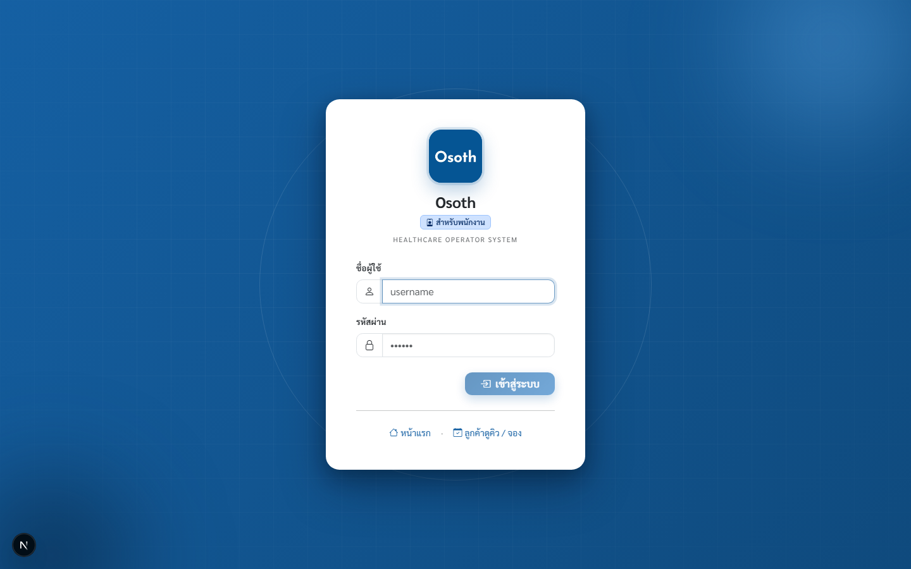

> ⚠️ **พนักงานใหม่ที่เพิ่งได้รหัสผ่าน:** ระบบจะบังคับให้ตั้ง **รหัสผ่านใหม่** และ **ยืนยันรหัสผ่าน** ก่อนเริ่มใช้งานครั้งแรก เพื่อกันคนอื่นรู้รหัสที่ผู้ดูแลตั้งให้

เข้าระบบแล้วแต่ละตำแหน่งจะเจอหน้าแรกไม่เหมือนกัน: เจ้าของเจอ **Dashboard** · แอดมิน/หมอ/BT ระบบพาไปหน้า **OPD / หน้าห้อง** · ฝ่ายขายพาไปหน้า **ปฏิทิน (จองคิว)** — พาไปหน้างานแรกของตำแหน่งตัวเองให้เลย ไม่ต้องหาเมนูเอง

## แถบด้านบน (Topbar) — ของที่ใช้ได้ทุกหน้า

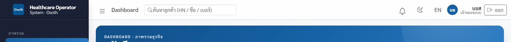

ไล่จากซ้ายไปขวา:

- **ปุ่มขีดสามเส้น** — ย่อ/ขยายเมนูด้านซ้าย ตามด้วยชื่อหน้าที่เปิดอยู่
- **ช่องค้นหาลูกค้า (HN / ชื่อ / เบอร์)** — HN คือเลขประจำตัวลูกค้าที่ระบบออกให้ พิมพ์อย่างน้อย 2 ตัวอักษร ระบบจะเด้งรายชื่อให้เลือก คลิกแล้วเปิดหน้าข้อมูลลูกค้าคนนั้นทันที (เห็นเฉพาะบทบาทที่เข้าหน้าลูกค้าได้ — เจ้าของ/แอดมิน/ฝ่ายขาย และจอเล็กอย่างมือถือจะไม่แสดงช่องนี้)
- **กระดิ่งแจ้งเตือน** — มีเรื่องใหม่ (เช่น คิว/เคส หรือสต๊อกใกล้หมด) จะขึ้นตัวเลขสีแดงบนกระดิ่ง กดเพื่อดูรายการล่าสุด เปิดดูแล้วระบบนับว่าอ่านแล้วให้เอง
- **ปุ่มพระจันทร์/พระอาทิตย์** — สลับ **โหมดมืด/สว่าง** ระบบจำค่าที่เลือกไว้ให้
- **ปุ่ม EN / ไทย** — สลับภาษาของหน้าจอ
- **ชื่อและบทบาทของคุณ** พร้อมปุ่ม **ออก** สำหรับออกจากระบบ

หน้าจอเมื่อเปิดโหมดมืด:

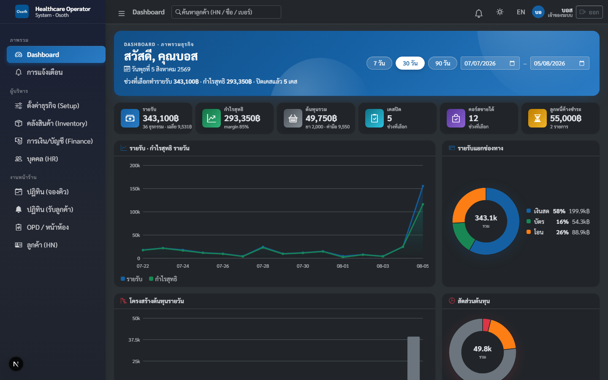

## ทัวร์เมนูทั้งหมด (มุมมองเจ้าของ — เห็นครบทุกเมนู)

เมนูด้านซ้ายแบ่งเป็น 3 กลุ่ม: **ภาพรวม** · **ผู้บริหาร** · **งานหน้าร้าน** (พนักงานจะมีกลุ่ม **บุคคล** เพิ่ม)

### 1) Dashboard (กลุ่ม "ภาพรวม" — เฉพาะเจ้าของ)

หน้าแรกของเจ้าของ — เปิดมาก็เห็นสุขภาพร้านทั้งหมดในจอเดียว เลือกช่วงเวลาได้ **7 วัน / 30 วัน / 90 วัน** หรือกำหนดวันที่เอง

ครึ่งบนเป็นการ์ดตัวเลข 6 ใบ: **รายรับ**, **กำไรสุทธิ**, **ต้นทุนรวม**, **เคสปิด**, **คอร์สขายได้**, **ลูกหนี้ค้างชำระ** ถัดลงมาเป็นกราฟ **รายรับ · กำไรสุทธิ รายวัน**, **รายรับแยกช่องทาง** (เงินสด/บัตร/โอน), **โครงสร้างต้นทุนรายวัน**, **สัดส่วนต้นทุน** และตารางอันดับ **รายได้ต่อคอร์ส (Top 7)** กับ **ท็อปพนักงาน — ค่ามือ+คอม (Top 7)**

ล่างสุดคือกล่องงานค้างที่ควรเหลือบดูทุกเช้า: **สต๊อกต้องจัดการ**, **ลูกหนี้ค้างนาน**, **PO ค้างรับ** — สามกล่องนี้ยิ่งว่างยิ่งดี

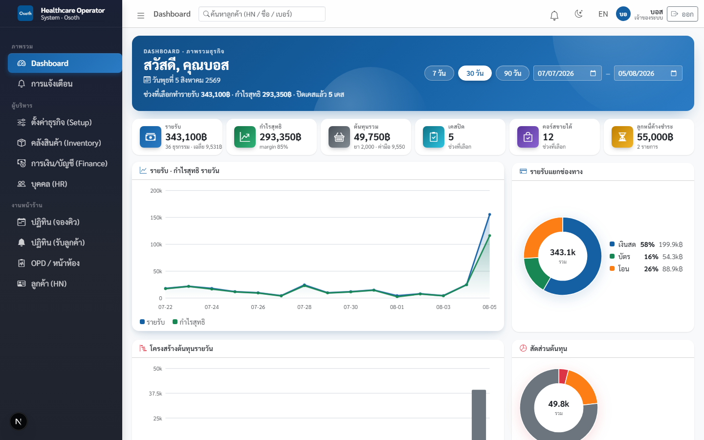

### 2) การแจ้งเตือน (ทุกบทบาทเห็น)

แจ้งเตือนชุดเดียวกับที่เด้งบนกระดิ่ง แต่หน้านี้เก็บย้อนหลังให้ดูทั้งหมด กรองตามประเภทได้ (**ทั้งหมด**, **ยังไม่อ่าน**, **คิว/เคส**, **สต๊อก**, **ทั่วไป**) ถ้าแจ้งเตือนกองเยอะจนตามไม่ไหว กด **อ่านทั้งหมดแล้ว** ทีเดียวจบ

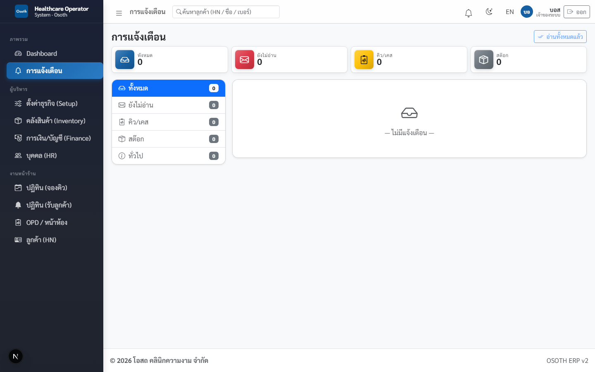

### 3) ตั้งค่าธุรกิจ (Setup) — เฉพาะเจ้าของ

อะไรที่ "ขาย" หรือ "จ่าย" ในระบบ ต้องมาตั้งที่นี่ก่อน — ถ้าหน้างานหาคอร์สไม่เจอ หรือค่ามือพนักงานออกมาเป็นศูนย์ ให้กลับมาเช็กหน้านี้เป็นที่แรก แบ่งเป็นแท็บ:

- **บริษัท & แบรนด์** — ชื่อบริษัท ที่อยู่ เลขผู้เสียภาษี โลโก้ สโลแกน และข้อความแนะนำร้านที่โชว์หน้าเว็บลูกค้า
- **ระบบ/ห้อง** — ตั้งค่าห้องทำหัตถการและระบบทั่วไป
- **บริการ (หัตถการ)** / **สินค้า** / **คอร์ส** / **โปรโมชั่น** — จัดการรายการที่ขายทั้งหมด
- **BT — ค่าตัว/ค่ามือ**, **หมอ — ค่าตัว/DF**, **Sale incentive** — อัตราค่ามือ/ค่าตอบแทนของแต่ละตำแหน่ง (DF = ค่ามือหมอ)

แก้เสร็จอย่าลืมกด **บันทึกทั้งหมด**

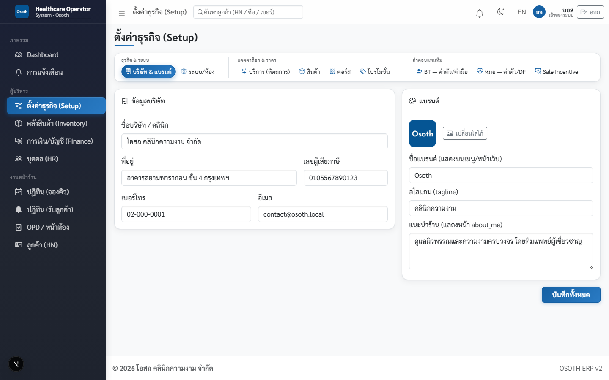

### 4) คลังสินค้า (Inventory) — เฉพาะเจ้าของ

แท็บในหน้านี้เรียงตามชีวิตจริงของยาหนึ่งขวด: เปิดใบ **สั่งซื้อ (PO)** ไปยังผู้ขาย → ของมาส่งก็บันทึกที่แท็บ **รับเข้า** → จากนั้นเวลาทำเคส ระบบตัดสต๊อกให้เองตอนปิดเคส (ไม่ต้องมาคีย์ที่หน้านี้) → ถึงรอบตรวจนับก็ใช้แท็บ **นับสต๊อก** เทียบของจริงกับตัวเลขในระบบ

แท็บ **สรุปสต๊อก** โชว์คงเหลือต่อสินค้า แยกเป็นขวด **ยังไม่เปิด** / **กำลังใช้** / **cc คงเหลือ** (ยาที่ใช้ทีละส่วน ระบบจำให้ว่าขวดที่เปิดอยู่เหลือกี่ cc) พร้อมคำเตือนของใกล้หมด ส่วน **รายงาน** ไว้ดูความเคลื่อนไหวของสต๊อกย้อนหลัง

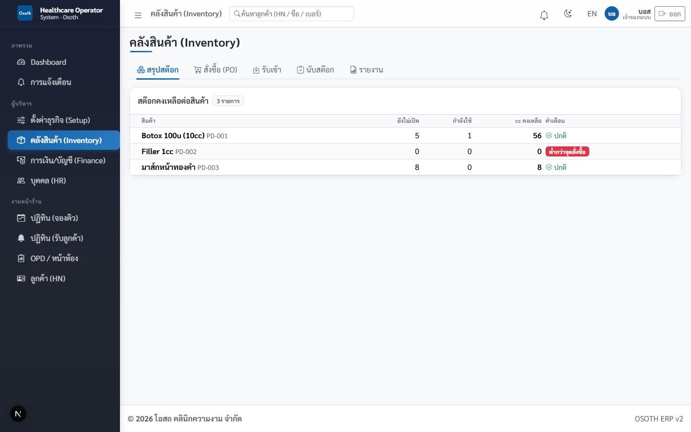

### 5) การเงิน/บัญชี (Finance) — เฉพาะเจ้าของ

หน้ารวมการเงินทั้งระบบ เบื้องหลังเป็นบัญชีคู่ (double-entry — ทุกยอดถูกบันทึกสองขาเดบิต/เครดิต ตรวจย้อนได้เสมอ) เลือกดูรวม **ทุกสาขา** หรือเจาะรายสาขาก็ได้ เมนูย่อยจัดเป็น 3 กลุ่มตามจังหวะงาน:

- **งานประจำวัน:** **รายวัน/ปิดยอด** (กราฟแนวโน้ม ยอดขายแยกคอร์ส/ช่องทาง/ประเภท + ปิดยอดสิ้นวัน + บันทึกรายจ่ายอื่น), **ใบเสร็จ**, **ปิดวัน/ปิดงวด**
- **รายงานบัญชี:** **งบกำไรขาดทุน**, **งบทดลอง**, **สมุดรายวัน**, **ผังบัญชี (GL)** — กลุ่มนี้สำหรับดูเป็นงวด หรือส่งให้ฝ่ายบัญชี
- **หนี้สิน & วางแผน:** **ลูกหนี้ (AR)**, **เจ้าหนี้ (AP)**, **งบประมาณ**, **คอมมิชชั่น**

หน้ารายวัน/ปิดยอดมีปุ่ม **🖨️ บันทึก PDF** และ **⬇ ส่งออก CSV** ไว้ดึงข้อมูลออกไปใช้ต่อ

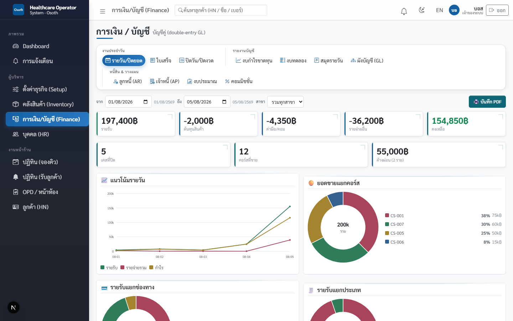

### 6) บุคคล (HR) — เฉพาะเจ้าของ

เรื่องพนักงานจบที่หน้านี้ แท็บที่ได้ใช้บ่อยสุดคือ **พนักงาน** — รายชื่อ ตำแหน่ง username เงินเดือน สถานะ และปุ่ม **เพิ่มพนักงาน** ซึ่งเป็นจุดเดียวที่สร้างบัญชีเข้าระบบให้พนักงานใหม่ (username/รหัสผ่านที่พนักงานใช้ login มาจากตรงนี้)

นอกนั้น **ตารางหมอ** ไว้จัดตารางออกตรวจของหมอแต่ละห้อง, **เงินเดือน** ไว้ทำรอบจ่ายเงินเดือน, ส่วน **ผังองค์กร** / **รายงาน** / **อัตราทำเคส** ไว้ดูโครงสร้างทีมและสถิติการทำงาน

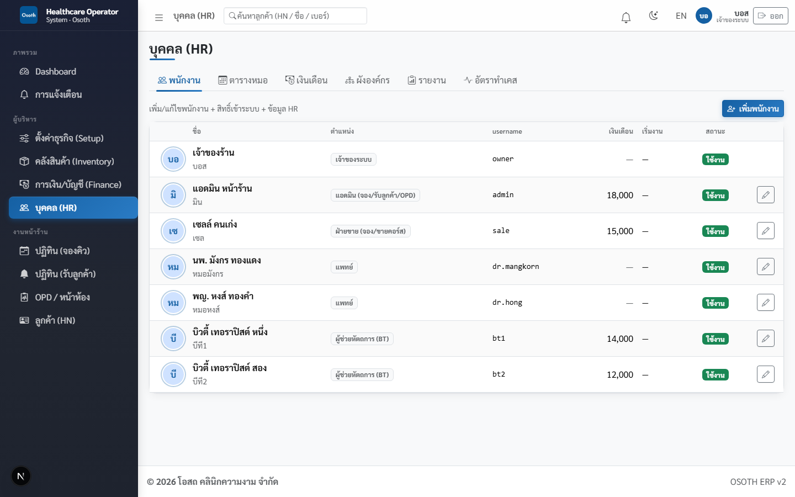

### 7) ปฏิทิน (จองคิว) — เจ้าของ/แอดมิน/ฝ่ายขาย

หน้าหลักของคนรับโทรศัพท์ — ลูกค้าโทรมาถามคิวเมื่อไหร่ เปิดหน้านี้ค้างไว้ได้เลย

ฝั่งซ้ายเป็นปฏิทินรายเดือน เห็นจำนวนคิวแต่ละวันว่าวันไหนแน่นแค่ไหน คลิกวันแล้วเห็น **ตารางห้อง** รายวัน — คลิกช่องว่างคือเลือกห้อง/เวลานั้น คลิกคิวที่จองไว้แล้วคือเข้าไปจัดการคิวนั้น (รายละเอียดอยู่บทที่ 2) ด้านบนมีการ์ดสรุปวันนี้: **คิววันนี้**, **รอรับ**, **มาถึงแล้ว**, **เสร็จ**

ฝั่งขวาคือฟอร์ม **จองคิว + เลือกคอร์ส**: ค้นหาลูกค้าเดิม หรือลูกค้าใหม่กรอกแค่ **ชื่อเล่น (ลูกค้าใหม่)** กับ **เบอร์โทร** ก็จองได้ เลือกคอร์สผูกกับการจองได้เลย (อยากขายคอร์สตั้งแต่ตอนจองก็ทำตรงนี้) เลือก **ห้อง** / **หมอ** / เวลา **เริ่ม** แล้วช่อง **จบ (อัตโนมัติ)** ระบบคำนวณให้ ถ้าลูกค้าเดินเข้ามาโดยไม่ได้จองล่วงหน้า ติ๊ก **Walk-in (ไม่ได้จองล่วงหน้า)** และถ้าโอนเงินจองมาแล้วก็ **แนบสลิปจ่ายเงินจอง (ถ้ามี)** เก็บเป็นหลักฐานไว้ในคิวเลย

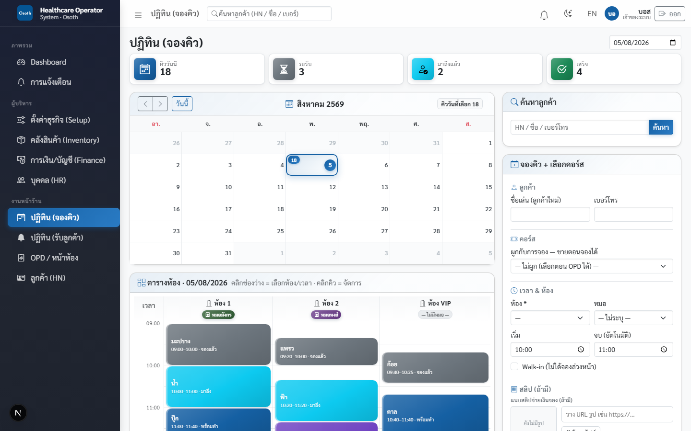

### 8) ปฏิทิน (รับลูกค้า) — เจ้าของ/แอดมิน/ฝ่ายขาย

หน้าตาเหมือนปฏิทินจองคิว แต่ใช้คนละจังหวะ — หน้านี้ใช้ตอนลูกค้า **มาถึงร้านจริง** คลิกคิวเพื่อ **รับเข้า/เปิดเคส** สถานะคิวจะขยับจาก "จองแล้ว" → "มาถึง" แล้วส่งต่อเข้าห้องทำหัตถการ

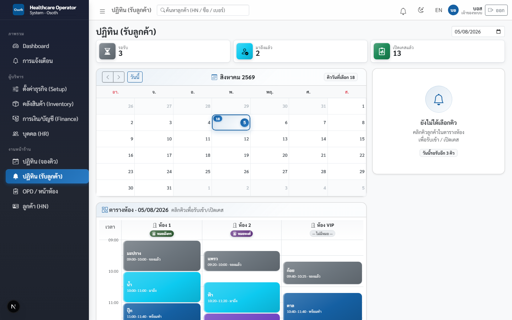

### 9) OPD / หน้าห้อง — เจ้าของ/แอดมิน/หมอ/BT

บ้านของทีมรักษา — หมอกับ BT อยู่กับหน้านี้ทั้งวัน และแอดมินก็ใช้หน้านี้ปิดเคสเก็บเงิน สรุปงานคือ **เปิดเคส · ทำหัตถการ · ปิดเคส**

รายการคิวอยู่ด้านซ้าย (ค้นหาด้วย HN / ชื่อ / ห้อง ได้) — คิวใหม่กด **เปิดเคส** เคสที่ค้างอยู่กด **ทำต่อ** เคสที่เสร็จแล้วกด **ดู** ย้อนหลังได้ เลือกคิวแล้วรายละเอียดเคสจะขึ้นด้านขวา: บันทึกหัตถการ ยาที่ใช้ และปิดเคสเก็บเงิน แถบบนสรุปสถานะคิวของวัน: **ทั้งหมด**, **รอทำ**, **ปรึกษาหมอ**, **BT ทำ**, **หมอทำ**, **เสร็จ**

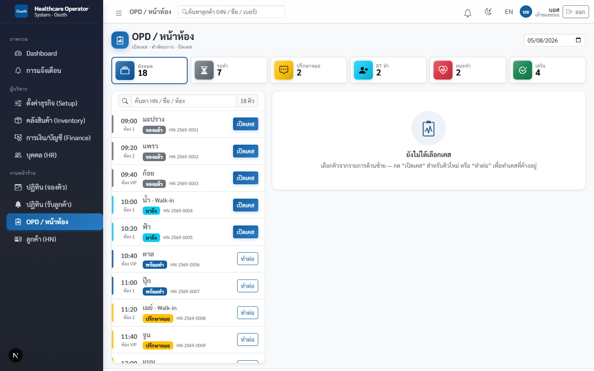

### 10) ลูกค้า (HN) — เจ้าของ/แอดมิน/ฝ่ายขาย

ฐานข้อมูลลูกค้าทุกคน — อยากรู้ว่าลูกค้าคนไหนเหลือคอร์สกี่ครั้ง เคยทำอะไรไปบ้าง มาหาที่นี่ พิมพ์ **HN / ชื่อ / เบอร์โทร** แล้วกดปุ่ม **ค้นหา** (เว้นว่างไว้ระบบจะโชว์ลูกค้าล่าสุดให้) เปิดโปรไฟล์แล้วเห็นทั้งข้อมูลส่วนตัว คอร์สคงเหลือ และประวัติการทำหัตถการย้อนหลัง

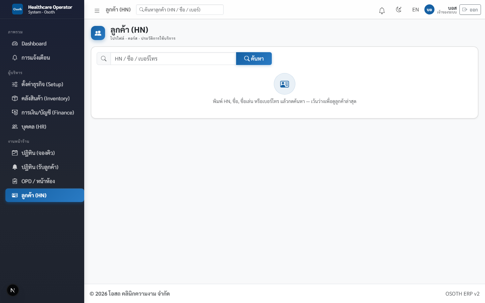

## เมนูสำหรับพนักงาน (กลุ่ม "บุคคล")

พนักงานทุกตำแหน่ง (แอดมิน/ฝ่ายขาย/หมอ/BT) จะเห็นกลุ่มเมนูนี้ — เจ้าของไม่เห็น เพราะเป็นเมนูส่วนตัวของพนักงาน (ตัวอย่างภาพด้านล่างเข้าระบบด้วยบัญชีผู้ช่วยหัตถการ)

### ลงเวลาเข้างาน

มาถึงร้านกดปุ่ม **เข้างาน** เลิกงานกดปุ่ม **ออกงาน** — แค่นั้น ด้านล่างมีตาราง **ประวัติลงเวลา** เก็บวันที่ เวลาเข้า-ออก และชั่วโมงรวมไว้ให้ดูย้อนหลัง

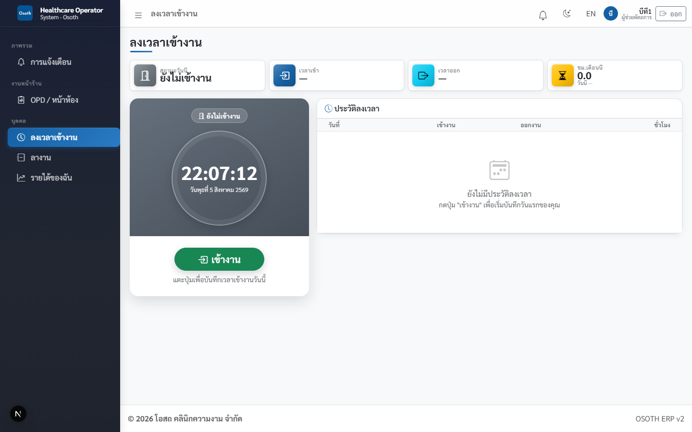

### ลางาน

ยื่นลาจากฟอร์ม **ยื่นคำขอลา**: เลือก **ประเภทการลา** ระบุ **ตั้งแต่วันที่** – **ถึงวันที่** กรอก **เหตุผล** แล้วกด **ส่งคำขอ** จากนั้นตามผลได้ที่กล่อง **คำขอของฉัน** ว่าอนุมัติแล้วหรือยัง

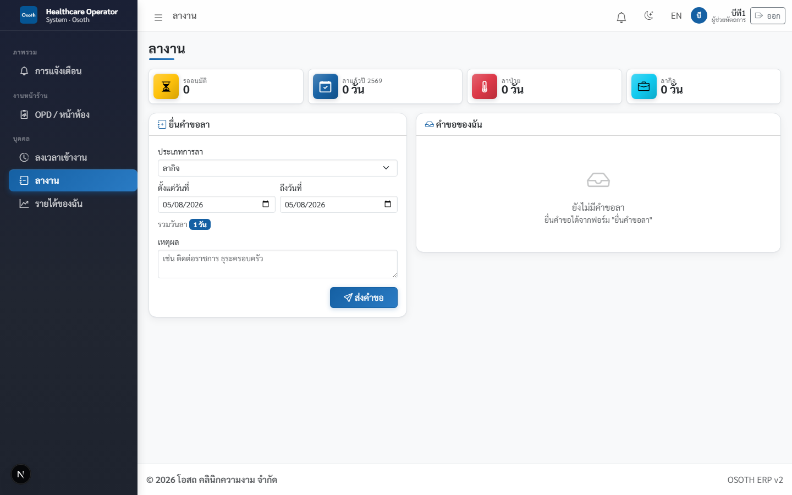

### รายได้ของฉัน

ค่ามือ/คอมของตัวเอง ระบบคิดให้อัตโนมัติทุกครั้งที่เคสถูกปิด ไม่ต้องจดเอง — การ์ดสรุปโชว์ **เงินเดือนฐาน/เดือน**, **ค่ามือ/คอม (ช่วงที่เลือก)**, **ประกันสังคม 5%**, **ประมาณรับสุทธิ** ส่วนตาราง **รายละเอียดค่ามือ/คอม** แจกแจงรายวันพร้อมเลขเคสอ้างอิง ดาวน์โหลดเป็น **CSV** ได้

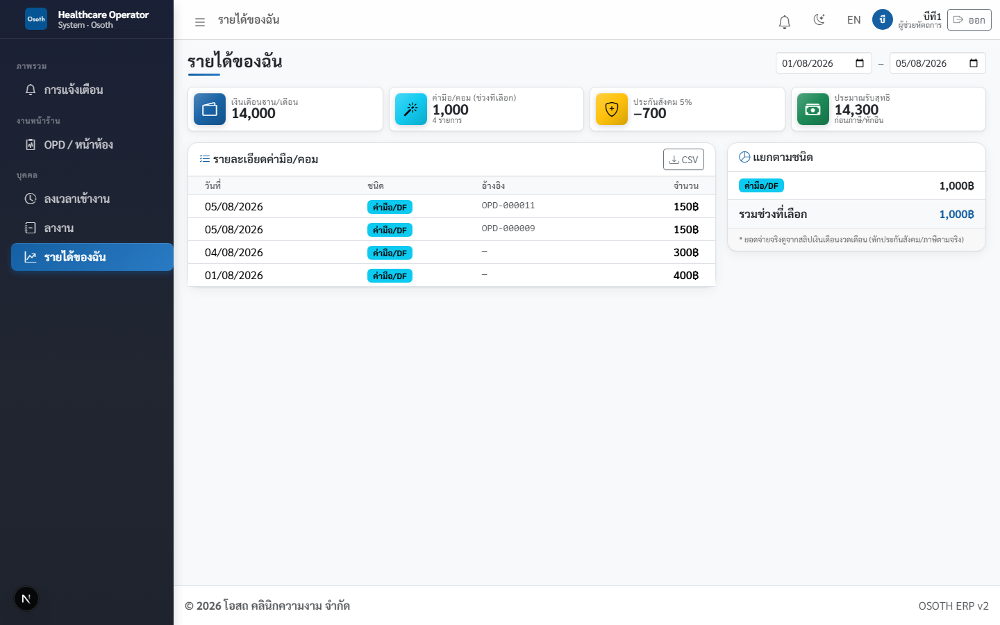

> 💡 ตัวเลขในหน้านี้เป็นประมาณการ — ยอดจ่ายจริงดูจากสลิปเงินเดือนงวดเดือน (หักประกันสังคม/ภาษีตามจริง)

## หน้าเว็บสำหรับลูกค้าทั่วไป (ไม่ต้องเข้าสู่ระบบ)

ลูกค้าที่เปิด **https://osoth.com** จะเจอหน้าเว็บสาธารณะของคลินิก:

### หน้าแรกคลินิก

แนะนำร้าน บริการ **คอร์ส & โปรโมชั่น** ที่กำลังจัด และช่องทาง **ติดต่อ & จองคิว** (โทร / LINE) มีปุ่ม **ดูคิวว่าง & จอง** พาไปหน้าปฏิทินคิว ส่วนปุ่ม **เข้าสู่ระบบ** มุมขวาบนเป็นทางเข้าของพนักงาน

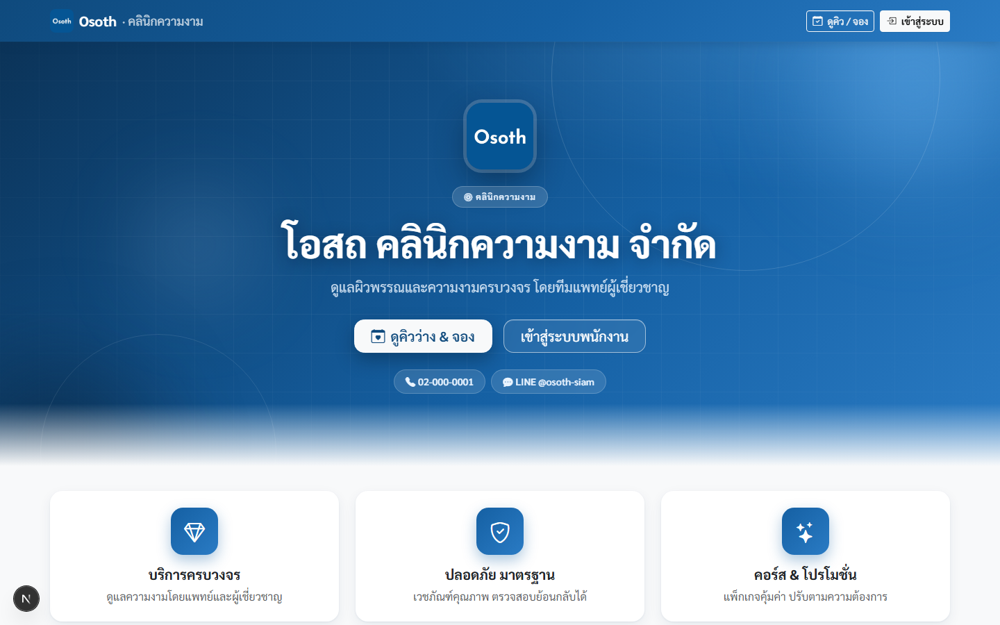

### ปฏิทินคิว (สำหรับลูกค้า)

ลูกค้าเช็กเองได้ว่าวันไหนคิวแน่นแค่ไหน: 🟢 **ว่างมาก (0–3 คิว)** · 🟡 **เริ่มแน่น (4–7 คิว)** · 🔴 **คิวแน่น (8+ คิว)** — ระบบแสดงแค่ช่วงว่าง/ไม่ว่าง ไม่เปิดเผยชื่อผู้จอง และมีกล่อง **หมอวันที่เลือก** บอกว่าหมอท่านไหนออกตรวจห้องไหน เวลาใด

ส่วนการจองจริงลูกค้าทำผ่าน **โทร** หรือ **LINE** ของร้าน แล้วพนักงานเป็นคนลงคิวในระบบให้ — เพราะฉะนั้นถ้าลูกค้าโทรมาบอกว่า "เห็นในเว็บว่าวันนี้ว่าง" ให้เปิดปฏิทินจองคิวเช็กช่องเวลาแล้วลงคิวให้ตามปกติ

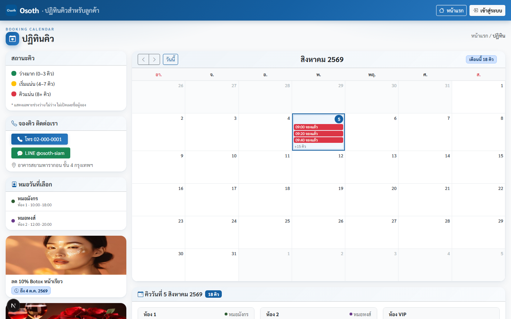

## สรุป: ใครเห็นเมนูอะไรบ้าง

| เมนู | เจ้าของ | แอดมิน | ฝ่ายขาย | แพทย์ | BT |
|---|:-:|:-:|:-:|:-:|:-:|
| Dashboard | ✅ | — | — | — | — |
| การแจ้งเตือน | ✅ | ✅ | ✅ | ✅ | ✅ |
| ตั้งค่าธุรกิจ (Setup) | ✅ | — | — | — | — |
| คลังสินค้า (Inventory) | ✅ | — | — | — | — |
| การเงิน/บัญชี (Finance) | ✅ | — | — | — | — |
| บุคคล (HR) | ✅ | — | — | — | — |
| ปฏิทิน (จองคิว) | ✅ | ✅ | ✅ | — | — |
| ปฏิทิน (รับลูกค้า) | ✅ | ✅ | ✅ | — | — |
| OPD / หน้าห้อง | ✅ | ✅ | — | ✅ | ✅ |
| ลูกค้า (HN) | ✅ | ✅ | ✅ | — | — |
| ลงเวลาเข้างาน / ลางาน / รายได้ของฉัน | — | ✅ | ✅ | ✅ | ✅ |

> ⚠️ ถ้าเปิดหน้าที่ไม่มีสิทธิ์ ระบบจะขึ้น **"ไม่มีสิทธิ์เข้าถึง"** พร้อมปุ่ม **กลับหน้างาน** — ถ้าคิดว่าตำแหน่งคุณควรเข้าหน้านั้นได้ ให้แจ้งผู้ดูแลระบบ/เจ้าของ

บทถัดไปจะพาลงลึกการใช้งานทีละโมดูล ตั้งแต่การจองคิวจนถึงการปิดเคสเก็บเงิน
