# บทที่ 2 — ขั้นตอนงานหน้าร้าน (OPD) ตั้งแต่จองคิวจนปิดเคส

บทนี้พาเดินงานหน้าร้าน "ทั้งเส้น" ตามลำดับที่เกิดขึ้นจริงในร้าน โดยใช้ตัวอย่างลูกค้าใหม่ชื่อ **สมศรี** ตั้งแต่โทรมาจองคิว → มาถึงร้าน → ทำหัตถการ → จ่ายเงิน → ปิดเคส

เมนูที่ใช้ในบทนี้ (อยู่ในหมวด **งานหน้าร้าน** ของเมนูด้านซ้าย เข้าใช้งานที่ https://osoth.com):

| เมนู | ใช้ทำอะไร | ใครใช้เป็นหลัก |
|---|---|---|
| **ปฏิทิน (จองคิว)** | จองคิวล่วงหน้า ขายคอร์ส รับมัดจำ เลื่อน/ยกเลิกนัด | เซลส์ / แอดมิน |
| **ปฏิทิน (รับลูกค้า)** | เช็คอินลูกค้าที่มาถึง สร้าง HN เปิดเคส | แอดมิน |
| **OPD / หน้าห้อง** | ทำเคสในห้อง: วัดตัว เก็บเงิน เซ็นเอกสาร บันทึกหัตถการ ปิดเคส | แอดมิน / หมอ / BT |

> 💡 สิทธิ์การใช้งานโดยสรุป — **เซลส์ (sale)** จองคิว ขายคอร์ส รับมัดจำ และรับชำระเงินได้ แต่เข้าไปทำเคสใน OPD ไม่ได้ · **หมอ/BT** เห็นเฉพาะคิวของตัวเองใน OPD และบันทึกหัตถการได้ · **แอดมิน/เจ้าของ** ทำได้ครบทุกขั้น รวมถึงเป็นผู้กด **ปิดเคส** เท่านั้น

---

## 1. จองคิวให้ลูกค้า — เมนู **ปฏิทิน (จองคิว)**

หน้าจอนี้แบ่งเป็น 2 ฝั่ง: ฝั่งซ้ายคือปฏิทินเดือน + **ตารางห้อง** ของวันที่เลือก (แกนตั้งคือเวลา 09:00–20:00 แกนนอนคือห้อง) ฝั่งขวาคือการ์ด **ค้นหาลูกค้า** และการ์ด **จองคิว + เลือกคอร์ส**

### 1.1 เลือกลูกค้า (ลูกค้าใหม่ / ลูกค้าเดิม)

**ลูกค้าใหม่ (ยังไม่เคยมี HN):**

1. ที่การ์ด **จองคิว + เลือกคอร์ส** ส่วน **ลูกค้า** กรอกช่อง **ชื่อเล่น (ลูกค้าใหม่)** และ **เบอร์โทร**
   (ยังไม่ต้องกรอกประวัติเต็ม — ประวัติจริงจะกรอกตอนลูกค้ามาถึงร้านครั้งแรก)

**ลูกค้าเดิม:**

1. ที่การ์ด **ค้นหาลูกค้า** พิมพ์ **HN / ชื่อ / เบอร์โทร** แล้วกดปุ่ม **ค้นหา**
2. กดเลือกชื่อลูกค้าจากรายการ — ระบบจะแสดง HN และ **คอร์สค้าง** ของลูกค้าคนนั้นให้เห็นทันที (เช่น "Botox หน้าเรียว 5 ครั้ง · เหลือ 4/5")

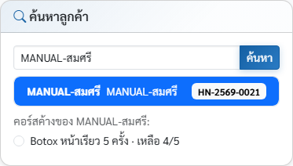

### 1.2 เลือกคอร์สผูกกับการจอง (ขายคอร์สตอนจองได้เลย)

ที่ส่วน **คอร์ส** ช่อง **ผูกกับการจอง — ขายตอนจองได้** เลือกได้ 3 แบบ:

| ตัวเลือก | ความหมาย |
|---|---|
| **— ไม่ผูก (เลือกตอน OPD ได้) —** | ยังไม่ระบุคอร์ส ไปตกลงกันหน้างานวันนัด |
| กลุ่ม **คอร์สเดิมของลูกค้า** | มาใช้สิทธิ์คอร์สที่ซื้อไว้แล้ว (แสดงจำนวนครั้งคงเหลือ) |
| กลุ่ม **ขายคอร์สใหม่ (จ่ายเต็มที่ OPD)** | ขายคอร์สใหม่ผูกกับคิวนี้เลย เช่น "Botox หน้าเรียว 5 ครั้ง · 15,000฿ · 5 ครั้ง" |

> ⚠️ **จองคิวไม่ต้องจ่ายเงินคอร์ส** — ใต้ฟอร์มจองมีข้อความกำกับว่า "จองไม่ต้องจ่าย · จ่ายค่าคอร์สเต็มจำนวนก่อนทำหัตถการที่ OPD" การขายคอร์สตอนจองเป็นแค่การจองสิทธิ์ เงินคอร์สเก็บเต็มจำนวนวันที่มาทำจริง (เก็บได้เฉพาะ "มัดจำกันคิว" — ดูข้อ 1.5)

### 1.3 เลือกห้องและเวลา

1. วิธีที่เร็วที่สุด: **คลิกช่องว่างในตารางห้อง** ตรงห้องและเวลาที่ต้องการ (หัวตารางเขียนกำกับว่า "คลิกช่องว่าง = เลือกห้อง/เวลา · คลิกคิว = จัดการ") — ระบบจะเติมช่อง **ห้อง** และเวลา **เริ่ม** ให้อัตโนมัติ
2. เวลา **จบ (อัตโนมัติ)** ระบบคำนวณให้จากระยะเวลาของคอร์สที่เลือก (แก้เองได้)
3. จะเลือก **หมอ** ประจำคิวไว้เลยก็ได้ หรือปล่อย **— ไม่ระบุ —**
4. ถ้ามีสลิปโอนจากลูกค้า แนบได้ที่ **แนบสลิปจ่ายเงินจอง (ถ้ามี)**
5. ตรวจสรุปด้านล่าง (วันที่ · เวลา · ห้อง) แล้วกดปุ่ม **จองคิว** — ขึ้นข้อความ "จองคิวสำเร็จ" และคิวโผล่ในตารางทันที

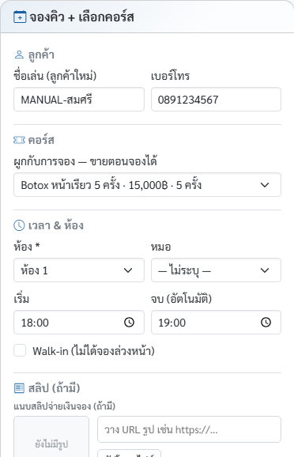

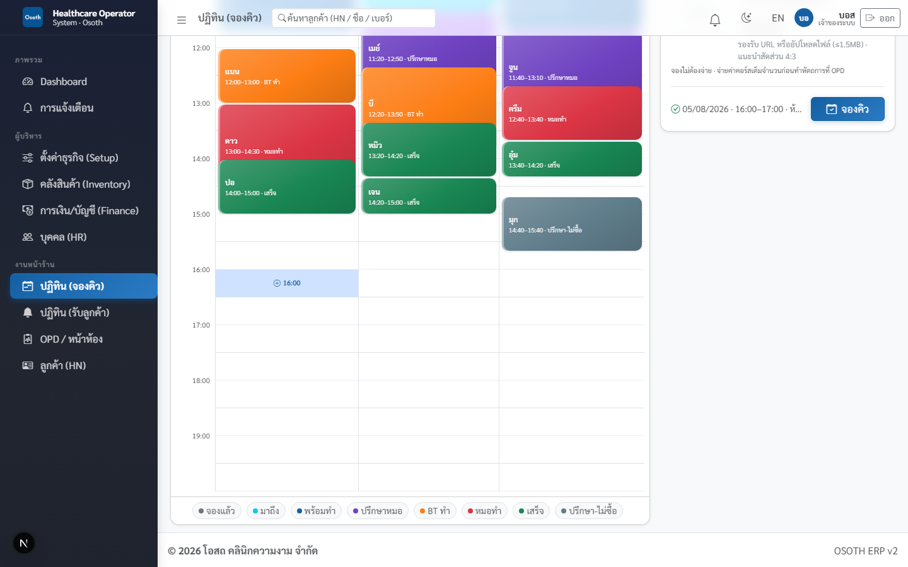

> 💡 ปุ่ม **จองคิว** จะกดได้ก็ต่อเมื่อเลือกห้องแล้ว (ถ้ายังไม่เลือก ระบบขึ้นว่า "เลือกห้องก่อนจอง")

### 1.4 การ์ดจัดการคิว (คลิกที่คิวในตาราง)

คลิกที่แถบคิวในตารางห้อง → การ์ดจัดการจะเด้งขึ้นใต้ตาราง แสดงชื่อ ห้อง เวลา เบอร์โทร สถานะ พร้อมปุ่ม:

- **ลูกค้ามาถึง** — เช็คอินเมื่อลูกค้ามาถึงร้าน (ทำจากหน้า **ปฏิทิน (รับลูกค้า)** ก็ได้)
- **เลื่อนนัด** — เปิดแผงเลือก **วันใหม่ / เริ่ม / จบ / ห้อง** แล้วกด **ยืนยัน**
- **ไม่มาตามนัด** — บันทึกลูกค้าเบี้ยวนัด (ดูผลกับมัดจำในหัวข้อ 5.1)
- **✕ ยกเลิกการจอง** — ยกเลิกคิวนี้
- **รับลูกค้า/เปิดเคส →** — ทางลัดไปหน้า **ปฏิทิน (รับลูกค้า)**

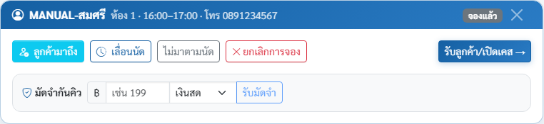

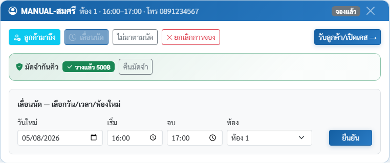

### 1.5 รับมัดจำกันคิว

ในการ์ดจัดการคิว มีแถบ **มัดจำกันคิว**:

1. กรอกจำนวนเงิน (ช่องตัวอย่าง "เช่น 199")
2. เลือกช่องทาง **เงินสด / โอน / บัตร**
3. กดปุ่ม **รับมัดจำ** — ระบบออกใบเสร็จมัดจำให้อัตโนมัติ (ขึ้นข้อความเช่น "รับมัดจำ 500฿ แล้ว · ใบเสร็จ RC2569-00008")

หลังวางมัดจำ แถบจะแสดง **วางแล้ว 500฿** พร้อมปุ่ม **คืนมัดจำ** เงินมัดจำนี้ไปได้ 3 ทาง:

| เหตุการณ์ | ผลกับมัดจำ |
|---|---|
| ลูกค้ามาตามนัด | ใช้เป็นส่วนหนึ่งของการจ่ายค่าคอร์สที่ OPD ได้ (ขึ้น "หักเข้าค่าคอร์สแล้ว") |
| ลูกค้า**ไม่มาตามนัด** | ระบบ**ริบมัดจำอัตโนมัติ**ทันทีที่กดปุ่ม ไม่มาตามนัด (ขึ้น "ริบแล้ว") |
| ยกเลิกนัดล่วงหน้า | กดปุ่ม **คืนมัดจำ** คืนเงินให้ลูกค้า |

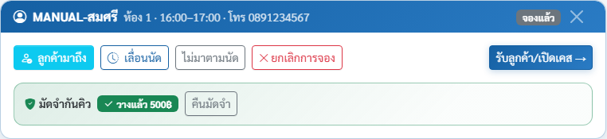

> 💡 ใต้แถบมัดจำมีคำอธิบายกำกับตลอดว่า "ริบอัตโนมัติเมื่อไม่มาตามนัด · หักเข้าค่าคอร์สตอนชำระที่ OPD"

---

## 2. วันนัด: รับลูกค้า + เปิดเคส — เมนู **ปฏิทิน (รับลูกค้า)**

หน้านี้หน้าตาเหมือนหน้าจองคิว แต่ใช้สำหรับ "รับลูกค้าเข้าเคส" — คลิกคิวในตารางห้อง แล้วจัดการที่แผงด้านขวา

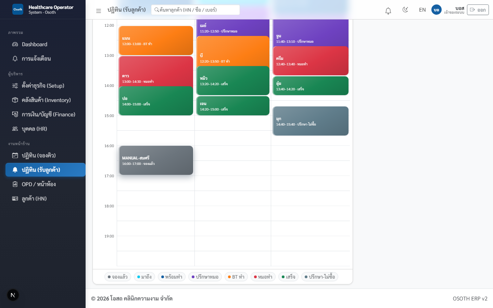

### 2.1 ลูกค้ามาถึง

1. คลิกคิวของลูกค้าในตารางห้อง → แผงขวาแสดงชื่อ ห้อง เวลา และแถบสถานะไล่ลำดับ **จองแล้ว → มาถึง → พร้อมทำ → BT ทำ → หมอทำ → เสร็จ**
2. กดปุ่ม **ลูกค้ามาถึง** — สถานะเปลี่ยนเป็น "มาถึง"

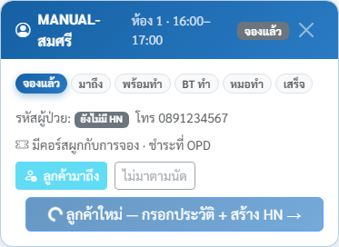

### 2.2 ลูกค้าใหม่ — กรอกประวัติ + สร้าง HN (ทำครั้งเดียวต่อคน)

ถ้าคิวนี้เป็นลูกค้าใหม่ (แผงขึ้นป้าย **ยังไม่มี HN**):

1. กดปุ่ม **ลูกค้าใหม่ — กรอกประวัติ + สร้าง HN →** จะเปิดเอกสาร **"ประวัติผู้ใช้บริการ / ข้อมูลสุขภาพ — สร้าง HN ใหม่"** เต็มจอ
2. **ส่วนที่ 1 ข้อมูลส่วนตัว** — คำนำหน้า, **ชื่อ*** (บังคับ), นามสกุล, ชื่อเล่น, เลขบัตรประชาชน, สัญชาติ, วันเกิด, เพศ, ที่อยู่ปัจจุบัน
3. **ส่วนที่ 2 การติดต่อ** — เบอร์ติดต่อ, ID LINE, อีเมล, ผู้ติดต่อกรณีฉุกเฉิน
4. **ส่วนที่ 3 ข้อมูลสุขภาพ** — สอบถามลูกค้าทีละข้อครบ **9 ข้อ** (โรคประจำตัว, HIV, ยาจิตเวช, การใช้ยา/อาหารเสริม, แพ้ยา/อาหาร, การผ่าตัด, หัตถการที่ผ่านมา, บุหรี่/แอลกอฮอล์, การตั้งครรภ์) แตะปุ่ม **ไม่มี** หรือ **มี** — ถ้า "มี" ต้องพิมพ์รายละเอียดในช่อง **ระบุรายละเอียด…**
5. **ส่วนที่ 4 คำยืนยัน + ลายเซ็นผู้ใช้บริการ** — ยื่น iPad ให้ลูกค้า**เซ็นชื่อในกรอบ** แล้วกด **ใช้ลายเซ็นนี้**
6. กดปุ่ม **สร้าง HN + เปิดเคส →** — ระบบสร้างรหัสผู้ป่วย (เช่น HN-2569-0021) บันทึกประวัติ และเปิดเคสให้ในคลิกเดียว

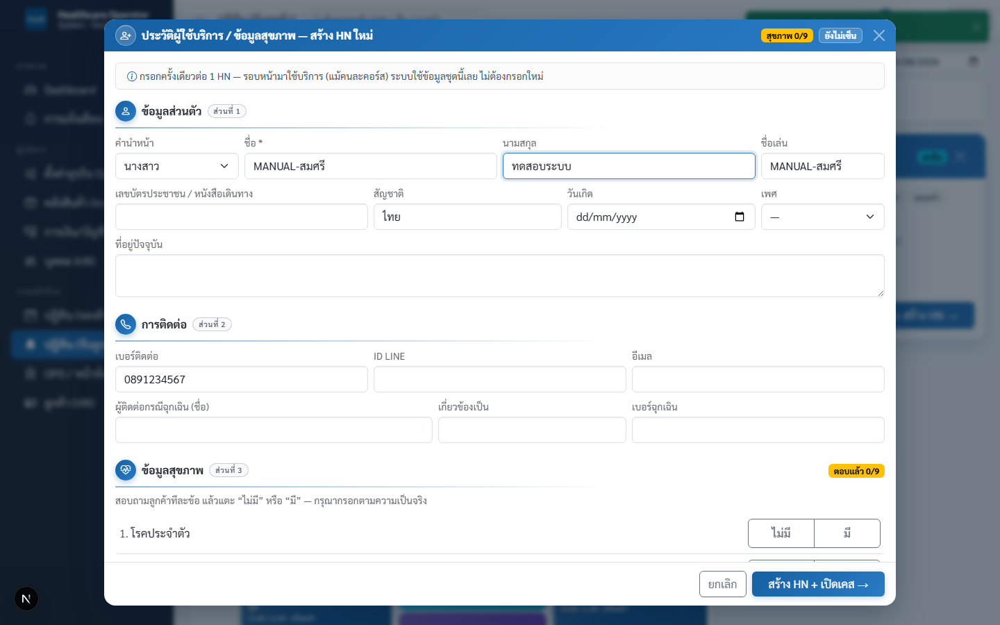

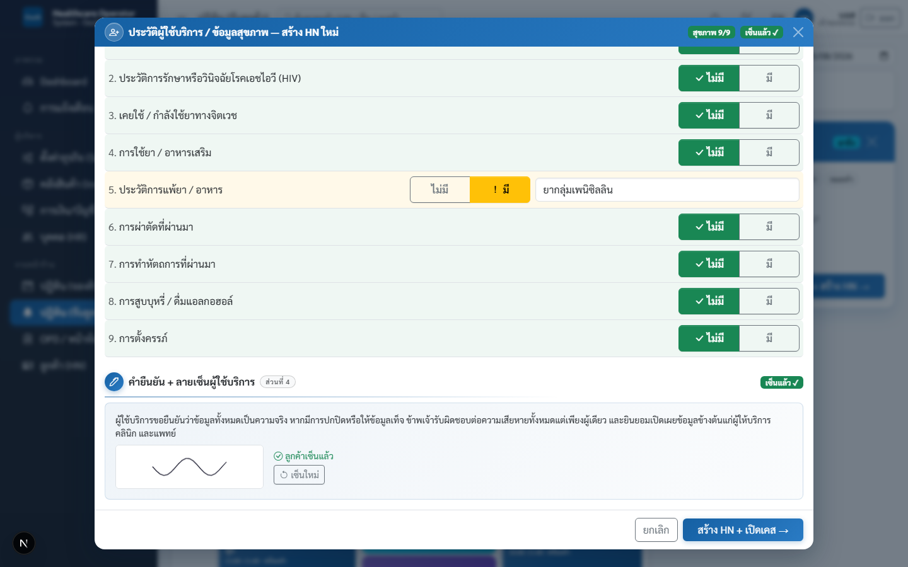

> 💡 หัวฟอร์มมีตัวนับ **สุขภาพ 0/9** และป้าย **ยังไม่เซ็น / เซ็นแล้ว ✓** ช่วยเช็กว่ากรอกครบหรือยัง — และปุ่มสร้าง HN จะกดได้เมื่อกรอกอย่างน้อย "ชื่อ"

> ⚠️ **กรอกครั้งเดียวต่อ 1 HN** — ในฟอร์มระบุชัดว่า "รอบหน้ามาใช้บริการ (แม้คนละคอร์ส) ระบบใช้ข้อมูลชุดนี้เลย ไม่ต้องกรอกใหม่"

### 2.3 ลูกค้าเดิม — เปิดเคสได้ทันที

ถ้าลูกค้ามี HN แล้ว แผงขวาจะแสดงรหัส HN พร้อมลิงก์ **ประวัติผู้ใช้บริการ / ข้อมูลสุขภาพ (ดู · พิมพ์ PDF)** และคำกำกับ "ลูกค้าเดิม — ใช้ข้อมูลชุดเดิม ไม่ต้องกรอกใหม่แม้คนละคอร์ส"

1. กดปุ่ม **เปิดเคส →** ได้เลย ไม่ต้องกรอกอะไรเพิ่ม

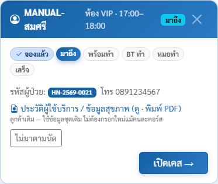

เมื่อเปิดเคสสำเร็จ แผงจะขึ้น **เปิดเคสแล้ว · OPD-xxxxxx** พร้อมปุ่ม **→ ไปที่ห้องทำเคส (OPD)**

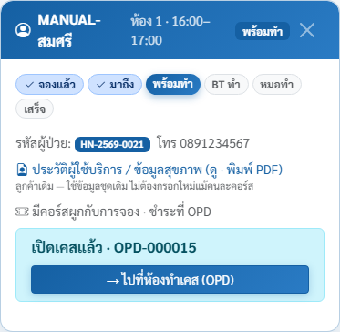

---

## 3. ในห้องทำเคส — เมนู **OPD / หน้าห้อง**

ฝั่งซ้ายคือรายการคิววันนั้น (มีช่องค้นหาและกล่องกรองสถานะ **ทั้งหมด / รอทำ / ปรึกษาหมอ / BT ทำ / หมอทำ / เสร็จ**) — กดปุ่ม **ทำต่อ** ที่คิวเพื่อเปิดหน้าจอเคส

หัวเคสแสดงชื่อลูกค้า, HN, **ครั้งที่** เท่าไรของคอร์ส และแถบขั้นตอนไล่ลำดับ: **เปิดเคส → วัดตัว → คอร์ส+ชำระ → ประวัติสุขภาพ → ใบยินยอม → BT → หมอ → ปิดเคส** (ขั้นที่ทำแล้วเป็นสีเขียว ✓ ขั้นปัจจุบันเป็นสีน้ำเงิน) ให้ไล่ทำตามการ์ดบนจอจากบนลงล่างได้เลย

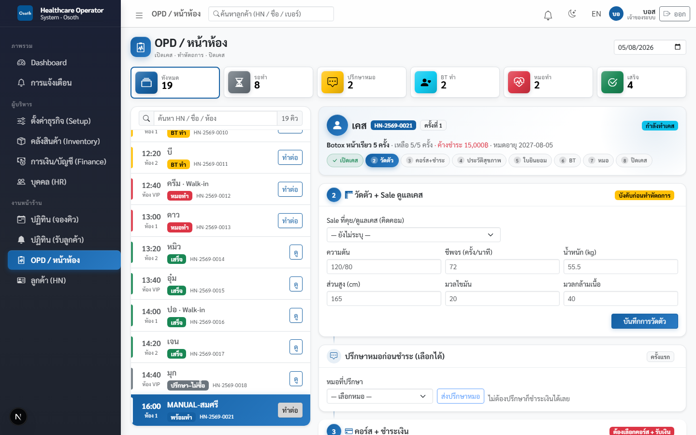

### 3.1 วัดตัว (บังคับทุกเคส)

การ์ด **วัดตัว + Sale ดูแลเคส** (ป้ายเตือน **บังคับก่อนทำหัตถการ**):

1. เลือก **Sale ที่คุย/ดูแลเคส (คิดคอม)** — เพื่อให้ระบบคิดค่าคอมมิชชันให้ถูกคน
2. กรอกผลวัดตัว: **ความดัน** (รูปแบบ เช่น 120/80), **ชีพจร (ครั้ง/นาที)**, **น้ำหนัก (kg)**, **ส่วนสูง (cm)**, **มวลไขมัน**, **มวลกล้ามเนื้อ**
3. กดปุ่ม **บันทึกการวัดตัว** — ป้ายการ์ดเปลี่ยนเป็น **วัดแล้ว ✓**

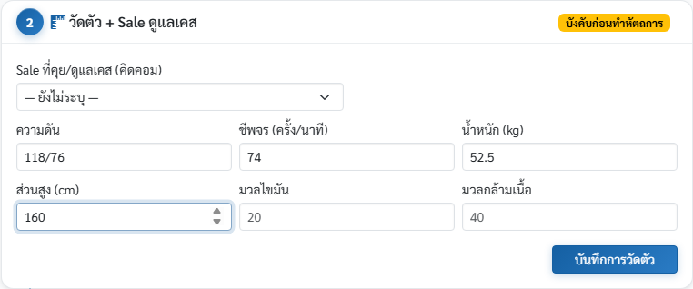

> 💡 ระบบกันกรอกเลขผิดช่วง เช่น น้ำหนักต้องอยู่ระหว่าง 20–300 kg ส่วนสูง 80–250 cm ชีพจร 30–220 — ถ้าเกินช่วง ช่องจะขึ้นสีแดงและกดบันทึกไม่ได้

> 💡 เคสครั้งแรกที่ลูกค้ายังลังเล มีการ์ด **ปรึกษาหมอก่อนชำระ (เลือกได้)** — เลือกหมอแล้วกด **ส่งปรึกษาหมอ** ถ้าคุยแล้วซื้อกด **✓ ตกลงซื้อ (ไปชำระ)** ถ้าไม่ซื้อกด **✕ ไม่ซื้อ — ปิดเคส** (เคสปิดแบบ "ปรึกษาแล้วไม่ซื้อ" ไม่ตัดสต๊อก ไม่มีค่ามือ) — ไม่ปรึกษาก็ข้ามไปชำระเงินได้เลย

### 3.2 เลือกคอร์ส + ชำระเงิน (จ่ายเต็มจำนวนเท่านั้น)

การ์ด **คอร์ส + ชำระเงิน** (ถ้ายังไม่เรียบร้อยจะมีป้ายแดง **ต้องเลือกคอร์ส + รับเงิน**):

**กรณียังไม่ได้ผูกคอร์สตอนจอง — ขั้นที่ 1 เลือกคอร์ส:**

1. เลือกปุ่ม **ขายคอร์สใหม่** (ขายคอร์สใหม่ให้ลูกค้า) หรือ **คอร์สเดิม (จำนวน)** (ใช้สิทธิ์คอร์สที่ซื้อไว้)
2. เลือกคอร์สจากรายการ

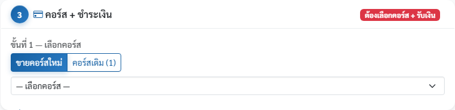

**ขั้นที่ 2 — รับชำระ (เลือกอย่างใดอย่างหนึ่ง):**

- **เลือกคอร์สนี้ (ยังไม่จ่าย · เพิ่ม add-on ก่อน แล้วจ่ายรวม)** — เหมาะเมื่อลูกค้าจะซื้อของเพิ่ม จะได้เก็บเงินทีเดียวบิลเดียว
- **จ่ายเต็มทันที** — กรอกช่องทางจ่ายแล้วจบเลย

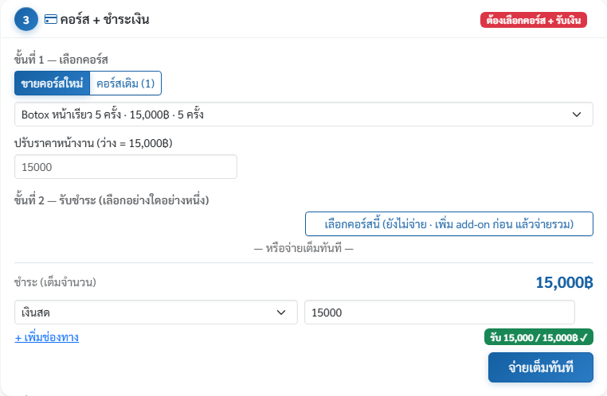

> 💡 เฉพาะแอดมิน/เจ้าของ จะเห็นช่อง **ปรับราคาหน้างาน** สำหรับปรับราคาคอร์สเคสนั้นๆ ได้ (เว้นว่าง = ราคาตามป้าย)

**รับชำระแบบแยกหลายช่องทาง (SplitPay):**

ช่องชำระเงินรองรับหลายบรรทัด แต่ละบรรทัดเลือกช่องทาง **เงินสด / โอน / บัตร** และถ้าคิวนี้วางมัดจำไว้ จะมีตัวเลือกพิเศษ **มัดจำที่วางไว้ (500฿)** ให้หักมัดจำเข้าเป็นค่าคอร์สด้วย

1. บรรทัดแรกเลือกช่องทาง + จำนวนเงิน
2. กด **+ เพิ่มช่องทาง** เพื่อเพิ่มบรรทัด (ระบบเติมยอดที่เหลือให้อัตโนมัติ)
3. ดูป้ายสรุปมุมขวา — ต้องขึ้น **รับ 15,900 / 15,900฿ ✓** (ยอดรวมทุกบรรทัดต้องเท่ายอดค้าง**พอดี** ปุ่มถึงจะกดได้)
4. กดปุ่ม **รับชำระ (เต็มจำนวน)**

ตัวอย่างจริง: คอร์ส 15,000฿ + add-on 900฿ = 15,900฿ จ่ายเป็น มัดจำที่วางไว้ 500 + โอน 5,000 + เงินสด 10,400

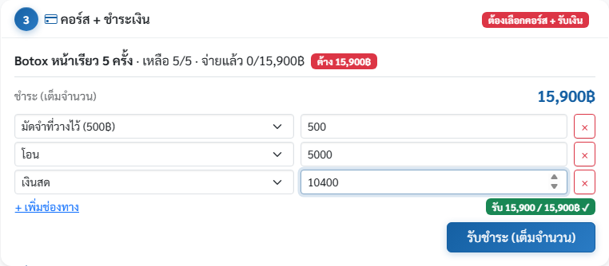

จ่ายครบแล้ว การ์ดจะขึ้นป้าย **ชำระครบ ✓** พร้อมปุ่ม **ใบเสร็จ** สำหรับเปิดใบเสร็จรับเงิน

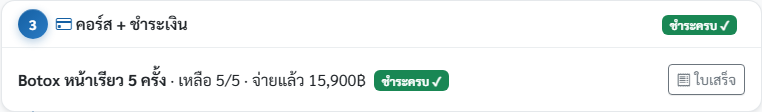

> ⚠️ **ระบบไม่มีผ่อนชำระ** — ค่าคอร์ส (รวม add-on ที่บวกเข้าบิล) ต้องจ่าย**เต็มจำนวนครั้งเดียว**ก่อนทำหัตถการและก่อนปิดเคส ถ้ายอดค้างยังไม่เป็นศูนย์ ระบบจะไม่ให้บันทึกขั้น BT/หมอ (ขึ้นข้อความแดง "ต้องชำระเงินก่อน") และปิดเคสไม่ได้

### 3.3 Add-on (ของแถม/ขายเพิ่มหน้างาน)

การ์ด **Add-on** ใช้เพิ่มสินค้า (เช่น มาส์กหน้า) หรือหัตถการเสริม กติกาต่างกันตามรอบที่มา — ดูชื่อการ์ดบนจอ:

| มาครั้งที่ | ชื่อการ์ดบนจอ | วิธีเก็บเงิน |
|---|---|---|
| ครั้งแรกของคอร์ส | **Add-on (ครั้งแรก = รวมบิลคอร์ส)** | ราคา add-on **บวกเข้ายอดคอร์ส** จ่ายรวมบิลเดียว — ปุ่ม **+ เพิ่มลงบิลคอร์ส** |
| ครั้งถัดไป | **Add-on (แยกบิลเก็บทันที)** | **เก็บเงินทันที**แยกบิล เลือกช่องทางเก็บเงินในการ์ดได้เลย — ปุ่ม **+ add-on (เก็บเงิน)** |

วิธีเพิ่ม:

1. เลือก **สินค้า (ตัด stock + คิดเงิน)** และ/หรือ **หัตถการ (ค่ามือ→BT/หมอ)** พร้อม **จำนวน**
2. เลือก **คนแนะ (คิดคอม)** — เซลส์หรือหมอที่แนะนำ เพื่อคิดค่าคอมให้ถูกคน
3. กดปุ่มเพิ่ม → ระบบขึ้นกล่องสรุปรายการ+ยอดเงินให้กดยืนยันก่อนทุกครั้ง

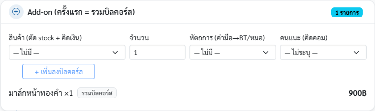

> ⚠️ **ลบ add-on ที่คีย์ผิดได้เฉพาะรายการที่ยังไม่ได้เก็บเงิน** — ถ้าเก็บเงินแยกบิลไปแล้ว ระบบจะขึ้นว่า "รายการนี้เก็บเงินแยกบิลไปแล้ว — ลบไม่ได้ (ต้องทำเรื่องคืนเงิน)" และถ้ายอดถูกจ่ายรวมกับคอร์สไปแล้วก็ลบไม่ได้เช่นกัน

### 3.4 ประวัติสุขภาพประจำคอร์ส (บังคับครั้งแรกของทุกคอร์ส)

เมื่อเป็น **ครั้งที่ 1** ของคอร์ส จะมีการ์ด **ประวัติสุขภาพ (เริ่มคอร์สครั้งแรก)** ป้ายเหลือง **ยังไม่บันทึก — บังคับก่อนปิดเคส**:

1. กดปุ่ม **ทวนข้อมูล + ให้ลูกค้าเซ็น (iPad)**
2. ระบบเปิดเอกสาร "ประวัติผู้ใช้บริการ / ข้อมูลสุขภาพ — คอร์ส …" โดย**ดึงคำตอบ 9 ข้อจากประวัติเดิมมาให้แล้ว** — ทวนกับลูกค้าทีละข้อ แก้เฉพาะข้อที่เปลี่ยน
3. ยื่น iPad ให้ลูกค้าเซ็นชื่อในกรอบ กด **ใช้ลายเซ็นนี้** แล้วกด **บันทึกประวัติสุขภาพ**
4. การ์ดเปลี่ยนเป็น **ลูกค้าเซ็นรับรองแล้ว ✓** — ดูย้อนหลัง/พิมพ์ได้จากปุ่ม **ดูเอกสาร / พิมพ์**

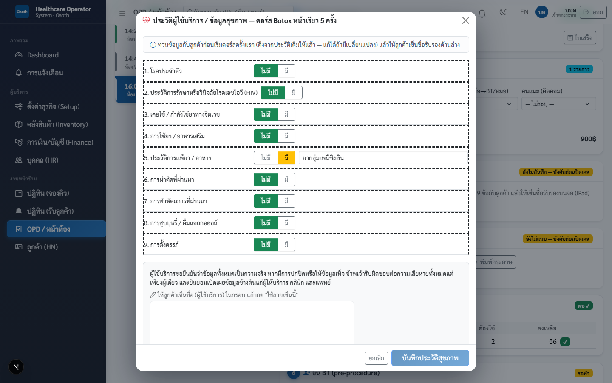

### 3.5 ใบยินยอมการทำหัตถการ (บังคับทุกเคส แม้คอร์สเดิม)

การ์ด **ใบยินยอมการทำหัตถการ** ต้องมีอย่างน้อย 1 ใบ**ทุกเคส** ก่อนปิดเคส เลือกวิธีได้ 3 ทาง:

- **อัปโหลดสแกน/รูป (≤5MB)** — แนบไฟล์ใบยินยอมกระดาษที่สแกนไว้
- **ให้ลูกค้าอ่าน + เซ็นบนจอ (iPad)** — วิธีหลัก: ระบบเปิด "หนังสือข้อตกลงในการใช้บริการและยินยอมทำหัตถการเสริมความงาม" เนื้อหา **7 ข้อ** พร้อมเติมชื่อลูกค้า/คอร์ส/วันที่ให้อัตโนมัติ ให้ลูกค้าอ่านจนจบ เซ็นชื่อในกรอบท้ายเอกสาร แล้วกด **ใช้ลายเซ็นนี้**
- **พิมพ์กระดาษ** — พิมพ์แบบฟอร์มเปล่าให้ลูกค้าเซ็นด้วยปากกา (แล้วค่อยสแกนแนบ)

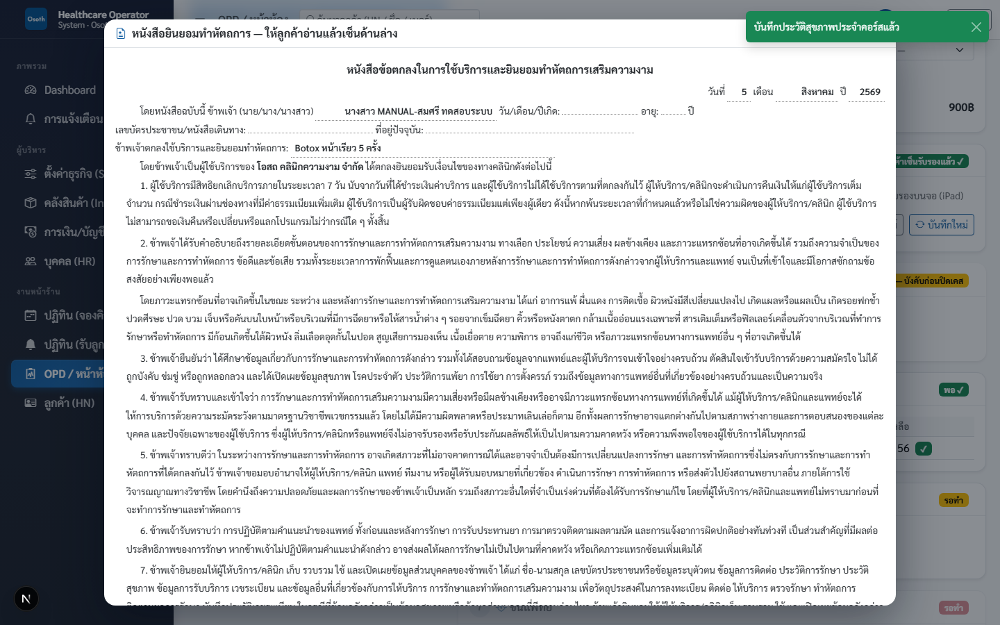

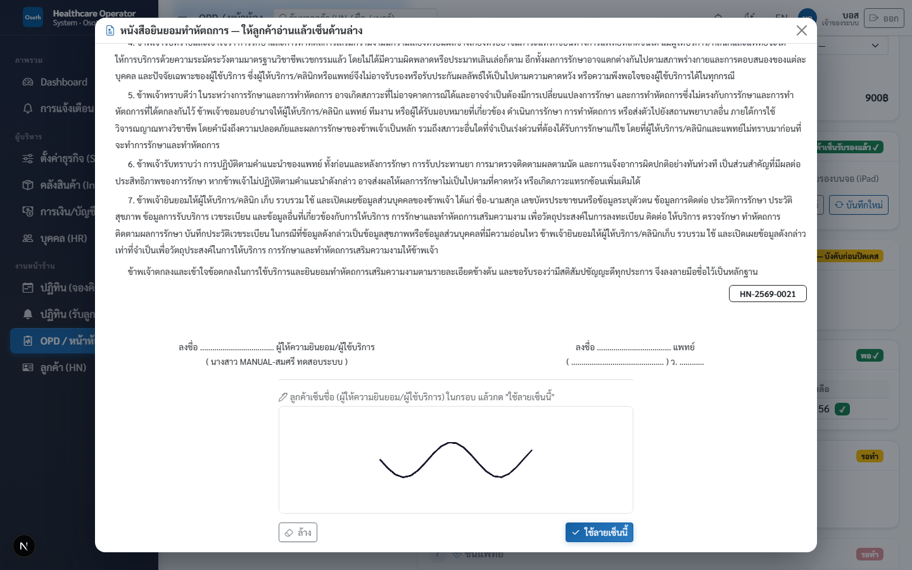

แนบแล้วการ์ดขึ้น **แนบแล้ว 1 ใบ ✓** — กดปุ่ม **ดู** เพื่อเปิดเอกสารพร้อมลายเซ็น หรือกด **×** เพื่อลบ (ลบได้ก่อนปิดเคสเท่านั้น)

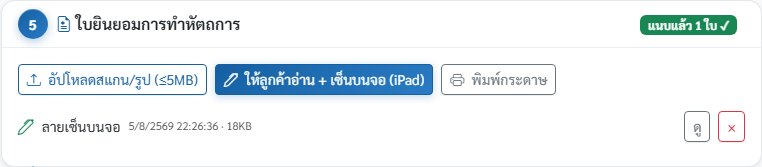

> ⚠️ ทดลองสั่งปิดเคสก่อนแนบใบยินยอม ระบบปฏิเสธพร้อมข้อความจริงว่า **"ต้องแนบใบยินยอมการทำหัตถการก่อนปิดเคส (อัปโหลด/เซ็นบนจอ)"** — และปุ่มปิดเคสบนจอจะกดไม่ได้จนกว่ารายการตรวจจะครบทุกข้อ

### 3.6 มอบหมายผู้ทำ + บันทึกหัตถการ (ขั้น BT / ขั้นแพทย์)

ใต้การ์ดชำระเงินมีการ์ด **สต๊อกสำหรับคอร์สนี้** แสดงว่ายาที่คอร์สต้องใช้มีพอไหม (**พอ ✓** / **ไม่พอ** พร้อมจำนวนที่ขาด) — ถ้าไม่พอต้องแจ้งผู้ดูแลคลังก่อน เพราะจะบันทึกหัตถการ/ปิดเคสไม่ได้

**การ์ด ขั้น BT (pre-procedure):** (ถ้าคอร์สไม่มีขั้น BT การ์ดจะขึ้น "— ข้ามอัตโนมัติ —")

1. เลือก **ผู้ทำ (BT)**
2. เมื่อ BT ทำหัตถการเตรียมผิว/แปะยาชาเสร็จ กดปุ่ม **บันทึก + เสร็จขั้น BT**

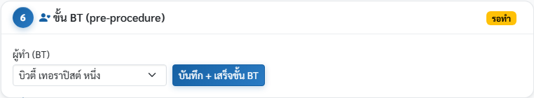

**การ์ด ขั้นแพทย์:**

1. เลือก **ผู้ทำ (แพทย์)**
2. กดปุ่ม **บันทึก + เสร็จขั้นแพทย์**

> ⚠️ ปุ่มบันทึกทั้งสองขั้นจะกดได้ต่อเมื่อ **วัดตัวแล้ว + ชำระครบ + สต๊อกพอ** และถ้าคอร์สมีขั้น BT ต้องบันทึกขั้น BT ก่อนขั้นแพทย์เสมอ (ระบบขึ้นเตือน "ทำขั้น BT ก่อน")

หัตถการที่บันทึกแล้วจะแสดงในตาราง **หัตถการที่บันทึก** พร้อมประเภท ผู้ทำ และ**ค่ามือ** ที่แต่ละคนจะได้

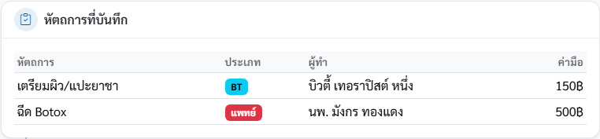

### 3.7 ปิดเคส (แอดมิน/เจ้าของเท่านั้น)

การ์ด **ปิดเคส** อยู่ล่างสุด มีคำอธิบายในการ์ดว่า: ปิดเคส = ตัด stock (FIFO) → นับครั้งคอร์ส → สร้างค่ามือหมอ/BT + คอม → คิวเป็น "เสร็จ" — ทั้งหมดนี้ระบบทำให้**อัตโนมัติในคลิกเดียว**

รายการตรวจก่อนปิด (ต้องเขียว ✓ ครบทุกข้อ ปุ่มถึงจะกดได้):

- วัดตัวแล้ว
- เลือกคอร์ส + ชำระครบ
- สต๊อกเพียงพอ
- แนบใบยินยอมแล้ว
- ประวัติสุขภาพ (ครั้งแรกของคอร์ส)

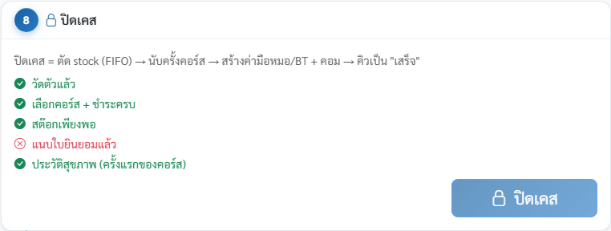

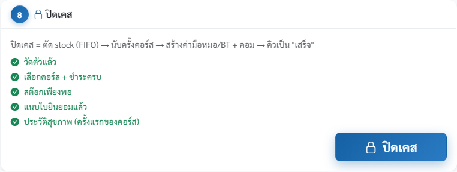

1. กดปุ่ม **ปิดเคส** — ระบบขึ้นสรุปทันที เช่น **"ปิดเคสสำเร็จ · ตัด stock 2 รายการ · เหลือ 4 ครั้ง"** (ตัดยาจากคลังแบบเข้าก่อน-ออกก่อน หักสิทธิ์คอร์ส 1 ครั้ง และบันทึกค่ามือ/ค่าคอมให้พนักงานอัตโนมัติ)
2. คิวในปฏิทินเปลี่ยนสถานะเป็น **เสร็จ** — เปิดเคสดูย้อนหลังได้ด้วยปุ่ม **ดู** ทุกอย่างจะอ่านได้อย่างเดียว แก้ไม่ได้แล้ว

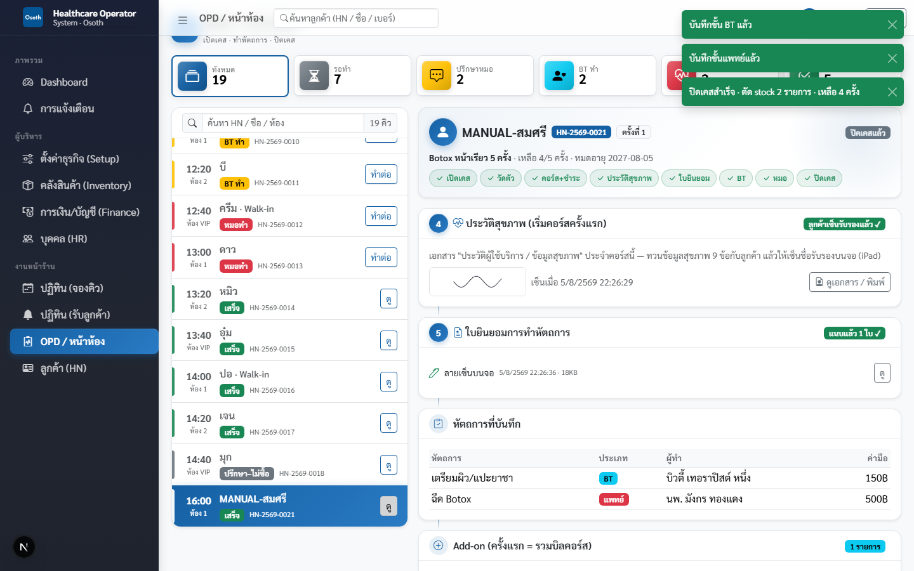

ท้ายเคสมีการ์ด **Timeline เคส** สรุปเหตุการณ์ทั้งหมดพร้อมเวลา — ใช้ตรวจย้อนหลังได้ว่าใครทำอะไรเมื่อไร

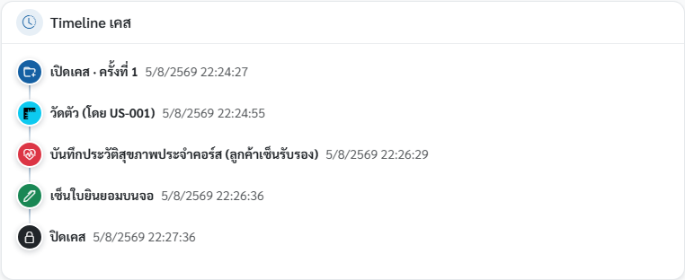

### 3.8 พิมพ์ใบเสร็จ / เอกสาร

- **ใบเสร็จค่าคอร์ส**: กดปุ่ม **ใบเสร็จ** ในการ์ดคอร์ส + ชำระเงิน → เปิดหน้า **ใบเสร็จรับเงิน** (กระดาษ A5) แสดงเลขที่ใบเสร็จ รายการ ยอดรวม และ**ช่องทางชำระทุกช่อง** (เช่น หักจากมัดจำ 500.00฿ · โอน 5,000.00฿ · เงินสด 10,400.00฿) → กดปุ่ม **พิมพ์ / บันทึก PDF**
- **ประวัติผู้ใช้บริการ / ใบยินยอม**: เปิดดู+พิมพ์ได้จากปุ่ม **ดูเอกสาร / พิมพ์** และ **ดู** ในการ์ดที่เกี่ยวข้อง

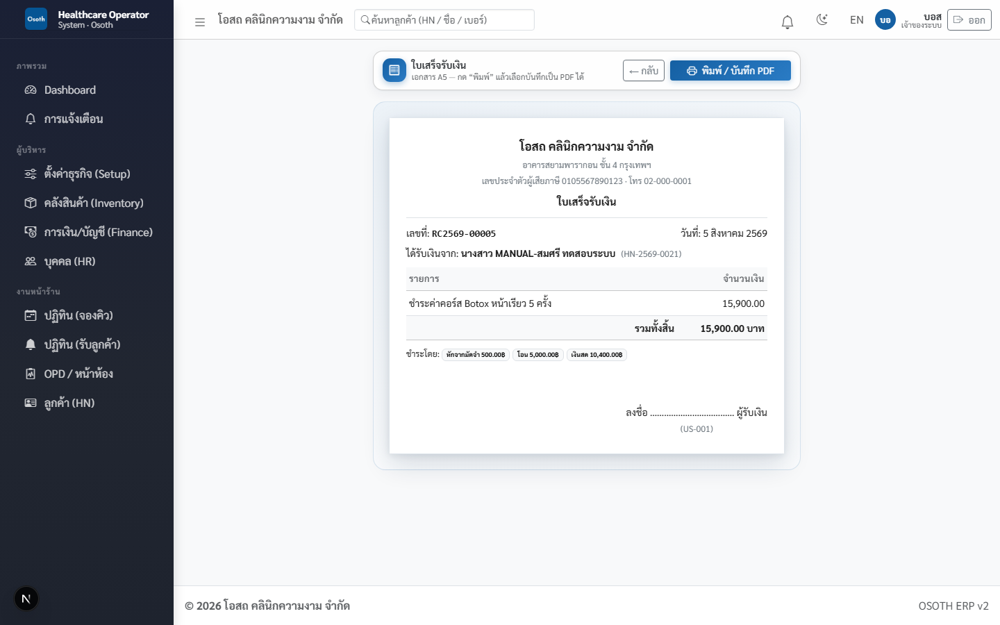

---

## 4. สรุปเส้นทางทั้งหมดในหน้าเดียว

| ขั้น | ที่ไหน | ทำอะไร | ปุ่มหลัก |
|---|---|---|---|
| 1 | ปฏิทิน (จองคิว) | ค้น/กรอกลูกค้า + เลือกคอร์ส + คลิกช่องเวลา | **จองคิว** |
| 2 | ปฏิทิน (จองคิว) | รับมัดจำกันคิว (แนะนำ) | **รับมัดจำ** |
| 3 | ปฏิทิน (รับลูกค้า) | ลูกค้ามาถึง → เช็คอิน | **ลูกค้ามาถึง** |
| 4 | ปฏิทิน (รับลูกค้า) | ลูกค้าใหม่กรอกประวัติ+เซ็น → ได้ HN / ลูกค้าเดิมข้ามได้ | **สร้าง HN + เปิดเคส →** หรือ **เปิดเคส →** |
| 5 | OPD / หน้าห้อง | วัดตัว (บังคับ) | **บันทึกการวัดตัว** |
| 6 | OPD / หน้าห้อง | เลือกคอร์ส + add-on + จ่ายเต็มจำนวน | **รับชำระ (เต็มจำนวน)** |
| 7 | OPD / หน้าห้อง | ครั้งแรกของคอร์ส: ทวนสุขภาพ 9 ข้อ + ลูกค้าเซ็น | **บันทึกประวัติสุขภาพ** |
| 8 | OPD / หน้าห้อง | ใบยินยอม 7 ข้อ + ลูกค้าเซ็น (ทุกเคส) | **ใช้ลายเซ็นนี้** |
| 9 | OPD / หน้าห้อง | บันทึกขั้น BT → ขั้นแพทย์ | **บันทึก + เสร็จขั้น BT / ขั้นแพทย์** |
| 10 | OPD / หน้าห้อง | ปิดเคส (แอดมิน) — ระบบตัดสต๊อก+ค่ามืออัตโนมัติ | **ปิดเคส** |

---

## 5. กรณีพิเศษที่เจอบ่อย

### 5.1 ลูกค้าไม่มาตามนัด (มัดจำถูกริบอัตโนมัติ)

1. เปิดคิวของลูกค้า (หน้า **ปฏิทิน (จองคิว)** หรือ **ปฏิทิน (รับลูกค้า)**) แล้วกดปุ่ม **ไม่มาตามนัด**
2. คิวจะหายจากตารางห้องทันที (ขึ้นข้อความ "บันทึกไม่มาตามนัด")
3. ถ้าคิวนั้นมีมัดจำวางไว้ ระบบ**ริบมัดจำเข้าเป็นรายได้ของร้านให้อัตโนมัติ** — ไม่ต้องทำอะไรเพิ่ม (ทดลองจริง: คิวที่วางมัดจำ 300฿ เมื่อกดไม่มาตามนัด สถานะมัดจำเปลี่ยนเป็น "ริบแล้ว" ทันที)

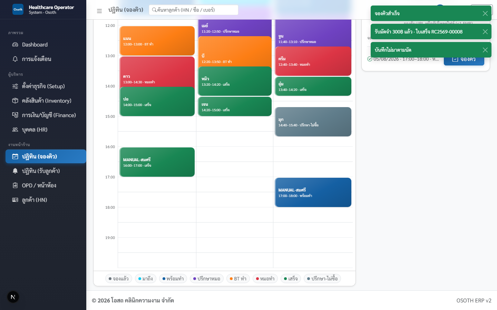

> ⚠️ ริบแล้วริบเลย — ถ้าลูกค้าโทรมาขอเลื่อนล่วงหน้า ให้ใช้ปุ่ม **เลื่อนนัด** (มัดจำติดไปกับคิวเดิม) หรือถ้ายกเลิกให้กด **คืนมัดจำ** ก่อน อย่าเพิ่งกดไม่มาตามนัด

### 5.2 ลูกค้า Walk-in (ไม่ได้จองล่วงหน้า)

1. ทำเหมือนจองคิวปกติที่หน้า **ปฏิทิน (จองคิว)** เลือกห้อง/เวลาปัจจุบัน แต่ติ๊กช่อง **Walk-in (ไม่ได้จองล่วงหน้า)** ก่อนกด **จองคิว**
2. คิวจะติดป้าย "· Walk-in" ให้เห็นในทุกหน้าจอ จากนั้นรับลูกค้า → เปิดเคส → ทำ OPD ตามขั้นตอนปกติทุกอย่าง

### 5.3 ลูกค้าเดิมมาซื้อคอร์สใหม่

- **ไม่ต้องกรอกประวัติใหม่** — ค้นหาลูกค้าด้วย HN/ชื่อ/เบอร์ตอนจอง แล้วเปิดเคสได้เลย (ระบบใช้ประวัติชุดเดิม)
- ที่ OPD เลือก **ขายคอร์สใหม่** ในการ์ดคอร์ส + ชำระเงิน
- แต่เพราะเป็น **ครั้งแรกของคอร์สใหม่** — ต้องทำ **ประวัติสุขภาพประจำคอร์ส** (ทวน 9 ข้อ + เซ็น) อีกรอบ และ**ใบยินยอม**ก็ต้องเซ็นใหม่ทุกเคสเหมือนเดิม

> 💡 มุมกลับ: ลูกค้าเดิมมาใช้สิทธิ์**คอร์สเดิม** (ครั้งที่ 2 เป็นต้นไป) — ไม่ต้องทำประวัติสุขภาพซ้ำ แต่**ใบยินยอมต้องเซ็นใหม่ทุกครั้ง** และ add-on จะกลายเป็นแบบ "แยกบิลเก็บทันที"
