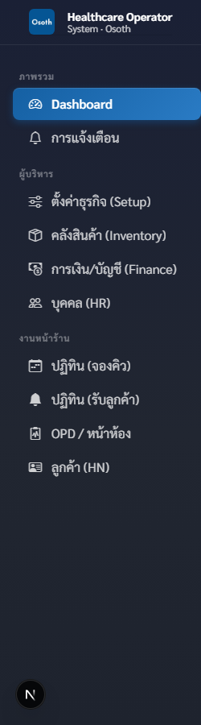
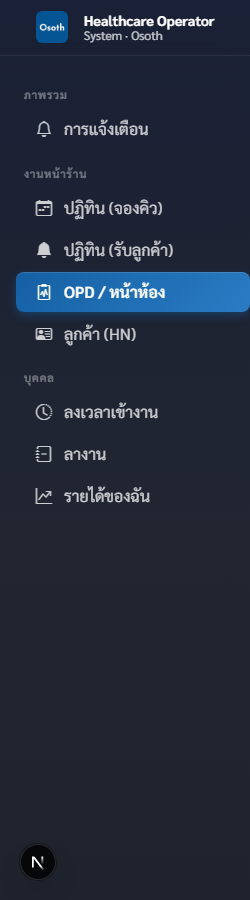
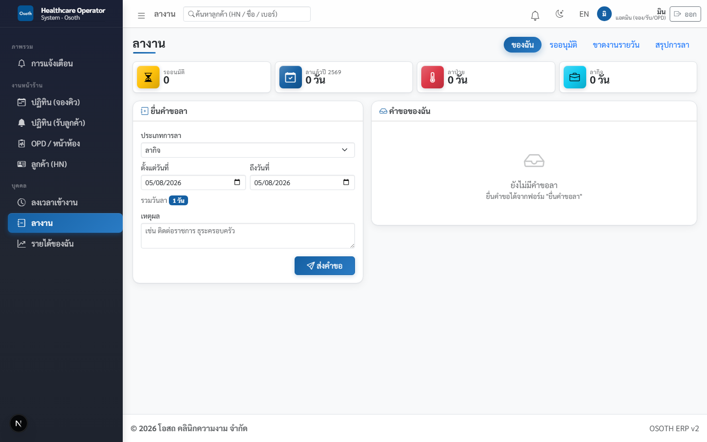
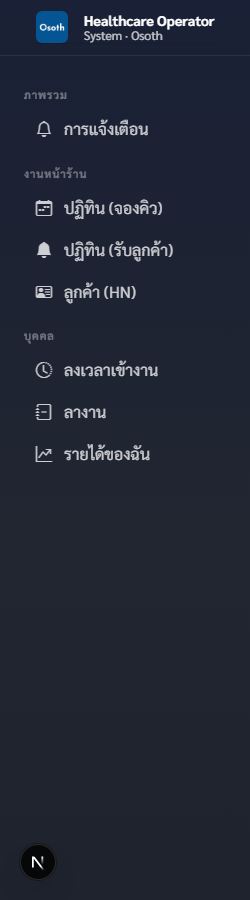
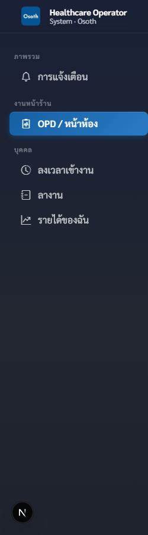

# บทที่ 3 — บทบาทและสิทธิ์: ใครทำอะไรได้บ้าง

ระบบ OSOTH (https://osoth.com) แบ่งผู้ใช้งานออกเป็น **5 บทบาท** แต่ละคนจะเห็นเมนูไม่เหมือนกัน และทำรายการได้ไม่เท่ากัน ชื่อบทบาทของคุณจะแสดงอยู่ **มุมขวาบนของจอ ใต้ชื่อเล่นของคุณ**

| บทบาทในระบบ | ป้ายที่แสดงบนจอ | หน้าที่หลัก |
|---|---|---|
| เจ้าของ (owner) | **เจ้าของระบบ** | บริหารทั้งระบบ — ตั้งค่า คลัง การเงิน เงินเดือน HR |
| แอดมิน | **แอดมิน (จอง/รับ/OPD)** | จองคิว รับลูกค้า ทำ OPD ครบวงจร ปิดเคส อนุมัติลา |
| เซลส์ | **ฝ่ายขาย** | จองคิว รับลูกค้า ขายคอร์ส |
| หมอ | **แพทย์** | ทำหัตถการในคิวของตัวเอง |
| BT | **ผู้ช่วยหัตถการ** | ทำหัตถการขั้น BT ในคิวที่ได้รับมอบ |

> 💡 สิทธิ์ทั้งหมด "ล็อกที่เซิร์ฟเวอร์" ไม่ใช่แค่ซ่อนเมนู — ต่อให้พยายามทำรายการข้ามสิทธิ์ ระบบจะปฏิเสธและขึ้นข้อความแจ้ง เช่น "เฉพาะเจ้าของระบบเท่านั้น" และถ้าเปิดหน้าที่ไม่มีสิทธิ์ จะเจอหน้า **ไม่มีสิทธิ์เข้าถึง** พร้อมปุ่ม **กลับหน้างาน**

## ตารางรวม: บทบาท × งาน

| งาน | เจ้าของ | แอดมิน | เซลส์ | หมอ | BT |
|---|:-:|:-:|:-:|:-:|:-:|
| ดู Dashboard ภาพรวมกิจการ | ✓ | ✗ | ✗ | ✗ | ✗ |
| จองคิว (**ปฏิทิน (จองคิว)**) | ✓ | ✓ | ✓ | ✗ | ✗ |
| รับลูกค้า / เปิดเคส (**ปฏิทิน (รับลูกค้า)**) | ✓ | ✓ | ✓ | ✗ | ✗ |
| สร้าง HN ลูกค้าใหม่ / แก้ข้อมูลลูกค้า | ✓ | ✓ | ✓ | ✗ | ✗ |
| ขายคอร์ส | ✓ | ✓ | ✓ | ✗ | ✗ |
| รับเงิน / รับมัดจำ | ✓ | ✓ | ✓ | ✗ | ✗ |
| **ปรับราคาหน้างาน** (ลดราคาจากราคาตั้ง) | ✓ | ✓ | ✗ | ✗ | ✗ |
| ทำงานหน้า **OPD / หน้าห้อง** (วัดตัว จัดคิว มอบหมายหมอ/BT) | ✓ | ✓ | ✗ | ✓* | ✓* |
| บันทึกหัตถการที่ทำเสร็จ | ✓ | ✓ | ✗ | ✓ | ✓ |
| **ปิดเคส** | ✓ | ✓ | ✗ | ✗ | ✗ |
| ดูใบเสร็จ | ✓ | ✓ | ✓ | ✗ | ✗ |
| **ยกเลิกใบเสร็จ** | ✓ | ✗ | ✗ | ✗ | ✗ |
| คลังสินค้า (รับของ ปรับสต๊อก ใบสั่งซื้อ) | ✓ | ✗ | ✗ | ✗ | ✗ |
| การเงิน/บัญชี (ปิดยอดวัน ค่าใช้จ่าย รายงาน) | ✓ | ✗ | ✗ | ✗ | ✗ |
| **ล็อกงวดบัญชี** | ✓ | ✗ | ✗ | ✗ | ✗ |
| ทำ **เงินเดือน (Payroll)** / แนบสลิปโอน | ✓ | ✗ | ✗ | ✗ | ✗ |
| ดูรายงานค่าคอม/ยอดขายของพนักงานทุกคน | ✓ | ✗ | ✗ | ✗ | ✗ |
| ตั้งค่าธุรกิจ (สาขา ห้อง คอร์ส โปรโมชั่น) | ✓ | ✗ | ✗ | ✗ | ✗ |
| HR (เพิ่มพนักงาน ตารางเวร ตั้งค่าคอม) | ✓ | ✗ | ✗ | ✗ | ✗ |
| สลับดูข้อมูลข้ามสาขา | ✓ | ✗ | ✗ | ✗ | ✗ |
| ลงเวลาเข้างาน / ยื่นใบลา | ✗** | ✓ | ✓ | ✓ | ✓ |
| **อนุมัติ/ไม่อนุมัติใบลา** | ✗** | ✓ | ✗ | ✗ | ✗ |
| ดู **รายได้ของฉัน** + สลิปเงินเดือนตัวเอง | ✗** | ✓ | ✓ | ✓ | ✓ |

\* หมอและ BT เข้าหน้า OPD ได้ แต่ **เห็นเฉพาะคิวของตัวเอง** (ดูรายละเอียดในหัวข้อของแต่ละบทบาทด้านล่าง)

\** เมนูกลุ่ม "บุคคล" (ลงเวลา / ลางาน / รายได้ของฉัน) เป็นเมนูฝั่งพนักงาน — เจ้าของไม่มีเมนูนี้ หน้าจออนุมัติใบลาอยู่ในเมนู **ลางาน** ผู้กดอนุมัติในทางปฏิบัติจึงเป็น **แอดมิน** (สิทธิ์ฝั่งระบบเปิดให้ทั้งแอดมินและเจ้าของ) ส่วนเจ้าของดูข้อมูลพนักงานทั้งหมดได้จากเมนู **บุคคล (HR)**

> ⚠️ กฎที่ต้องจำให้ขึ้นใจ
> - **ปรับราคาหน้างาน** ทำได้เฉพาะ **แอดมินกับเจ้าของ** — เซลส์ขายตามราคาตั้ง/ราคาโปรเท่านั้น ถ้าเซลส์พยายามใส่ราคาปรับเอง ระบบจะฟ้อง "ปรับราคาหน้างานได้เฉพาะ admin/เจ้าของ"
> - **ยกเลิกใบเสร็จ · ล็อกงวดบัญชี · เงินเดือน** เป็นอำนาจ **เจ้าของเท่านั้น** — แม้แต่แอดมินก็ทำไม่ได้ (ระบบจะขึ้น "เฉพาะเจ้าของระบบเท่านั้น")
> - **ปิดเคส** ทำได้เฉพาะ **แอดมินกับเจ้าของ** — หมอ/BT บันทึกหัตถการเสร็จแล้วส่งต่อให้แอดมินเป็นคนปิด

---

## เจ้าของ (เจ้าของระบบ)

เจ้าของเห็นเมนูมากที่สุด แบ่งเป็น 3 กลุ่ม

- **ภาพรวม** — **Dashboard** (สรุปกิจการ มีเฉพาะเจ้าของ) และ **การแจ้งเตือน**
- **ผู้บริหาร** — **ตั้งค่าธุรกิจ (Setup)** · **คลังสินค้า (Inventory)** · **การเงิน/บัญชี (Finance)** · **บุคคล (HR)** — ทั้ง 4 เมนูนี้มีเฉพาะเจ้าของ
- **งานหน้าร้าน** — **ปฏิทิน (จองคิว)** · **ปฏิทิน (รับลูกค้า)** · **OPD / หน้าห้อง** · **ลูกค้า (HN)** — เจ้าของลงมาช่วยงานหน้าร้านได้ทุกอย่าง

วันทำงานปกติ: เปิด **Dashboard** ดูภาพรวมยอดขาย/คิววันนี้ → เข้า **การเงิน/บัญชี (Finance)** ตรวจปิดยอดวัน → สิ้นเดือนทำเงินเดือนที่เมนู **บุคคล (HR)** และล็อกงวดบัญชีที่ **การเงิน/บัญชี (Finance)** เมื่อจำเป็นต้องยกเลิกใบเสร็จ (ออกผิด/ลูกค้าคืน) เจ้าของเป็นคนเดียวที่กดได้ และต้องกรอกเหตุผลทุกครั้ง

> 💡 เจ้าของเป็นคนเดียวที่ **สลับสาขา** ได้ — พนักงานคนอื่นเห็นเฉพาะข้อมูลสาขาของตัวเอง
>
> 💡 เจ้าของจะไม่เห็นเมนูกลุ่ม "บุคคล" (ลงเวลา/ลางาน/รายได้ของฉัน) เพราะเป็นเมนูของพนักงาน — ถ้าเปิดหน้านั้นตรง ๆ จะเจอ "ไม่มีสิทธิ์เข้าถึง" ซึ่งเป็นเรื่องปกติ

## แอดมิน (จอง/รับ/OPD)

แอดมินคือ "แม่งาน" ของหน้าร้าน — ทำได้ครบตั้งแต่จองจนปิดเคส

- **งานหน้าร้าน** — **ปฏิทิน (จองคิว)** · **ปฏิทิน (รับลูกค้า)** · **OPD / หน้าห้อง** · **ลูกค้า (HN)**
- **บุคคล** — **ลงเวลาเข้างาน** · **ลางาน** · **รายได้ของฉัน**

วันทำงานปกติ: เช้าเปิด **ปฏิทิน (รับลูกค้า)** รับลูกค้าตามคิวที่จองไว้ → ลูกค้าใหม่สร้าง HN ที่หน้า **ลูกค้า (HN)** → เปิดเคสเข้า **OPD / หน้าห้อง** วัดตัว ขายคอร์ส/รับเงิน มอบหมายหมอและ BT → หัตถการเสร็จแล้วแอดมินเป็นคน **ปิดเคส** ระหว่างวันถ้ามีลูกค้าโทรมาก็รับจองที่ **ปฏิทิน (จองคิว)**

งานพิเศษของแอดมิน

1. **ปรับราคาหน้างาน** — ตอนขายคอร์สใน OPD จะมีช่อง **ปรับราคาหน้างาน** ให้เฉพาะแอดมิน/เจ้าของกรอก (ต่อรองราคา/ส่วนลดพิเศษ)
2. **อนุมัติใบลา** — เปิดเมนู **ลางาน** แล้วกดแท็บ **รออนุมัติ** จะเห็นคำขอลาของพนักงานทุกคน กด **อนุมัติ** หรือ **ไม่อนุมัติ** ได้ (แท็บ **ขาดงานรายวัน** และ **สรุปการลา** ก็มีเฉพาะแอดมิน)

> ⚠️ แอดมินทำเรื่องเงิน "หน้าร้าน" ได้ทั้งหมด แต่เรื่อง "หลังบ้าน" ทำไม่ได้ — ยกเลิกใบเสร็จ คลังสินค้า การเงิน/บัญชี และเงินเดือน เป็นของเจ้าของเท่านั้น

## เซลส์ (ฝ่ายขาย)

เซลส์ทำงานเหมือนแอดมินในส่วนจอง/รับ/ขาย แต่ **ไม่มีเมนู OPD / หน้าห้อง**

- **งานหน้าร้าน** — **ปฏิทิน (จองคิว)** · **ปฏิทิน (รับลูกค้า)** · **ลูกค้า (HN)**
- **บุคคล** — **ลงเวลาเข้างาน** · **ลางาน** · **รายได้ของฉัน**

วันทำงานปกติ: รับสายลูกค้า/แชท แล้วลงจองที่ **ปฏิทิน (จองคิว)** พร้อมขายคอร์สและรับมัดจำได้เลยตอนจอง → ลูกค้ามาถึงก็ช่วยรับที่ **ปฏิทิน (รับลูกค้า)** และสร้าง HN ให้ลูกค้าใหม่ → ส่งเคสต่อให้แอดมินทำ OPD → สิ้นวันเปิด **รายได้ของฉัน** ดูค่าคอมจากยอดที่ขายได้

> ⚠️ เซลส์ขายตามราคาตั้ง/ราคาโปรเท่านั้น — **ปรับราคาหน้างานไม่ได้** ถ้าลูกค้าต่อรองราคา ให้ส่งต่อแอดมินหรือเจ้าของ

## หมอ (แพทย์)

- **งานหน้าร้าน** — **OPD / หน้าห้อง** (เมนูหน้าร้านเมนูเดียวของหมอ)
- **บุคคล** — **ลงเวลาเข้างาน** · **ลางาน** · **รายได้ของฉัน**

วันทำงานปกติ: เปิด **OPD / หน้าห้อง** — หมอจะ **เห็นเฉพาะคิวที่มอบหมายให้ตัวเอง** เท่านั้น (คิวของหมอท่านอื่นจะไม่ขึ้น) เมื่อลูกค้าพร้อม หมอเข้าเคส ทำหัตถการขั้นหมอ แล้วกดบันทึกหัตถการที่ทำเสร็จ ระบบจะคิดค่ามือเข้า **รายได้ของฉัน** ให้อัตโนมัติ สิ้นเดือนเปิดหน้าเดียวกันเพื่อดูสลิปเงินเดือน/สลิปโอนของตัวเอง

> 💡 หมอดูได้เฉพาะรายได้ของตัวเอง — ระบบไม่ให้ดูรายได้ของคนอื่น และหมอจองคิว/ขายคอร์ส/รับเงิน/ปิดเคสไม่ได้ (งานเหล่านี้เป็นของแอดมิน/เซลส์)

## BT (ผู้ช่วยหัตถการ)

BT เห็นเมนูชุดเดียวกับหมอ

- **งานหน้าร้าน** — **OPD / หน้าห้อง**
- **บุคคล** — **ลงเวลาเข้างาน** · **ลางาน** · **รายได้ของฉัน**

วันทำงานปกติ: เปิด **OPD / หน้าห้อง** — BT จะเห็น **คิวที่มอบหมายให้ตัวเอง รวมถึงคิวที่ยังไม่ได้ระบุตัว BT** (เผื่อหยิบงานได้) ทำหัตถการขั้น BT (pre-procedure) ก่อนส่งต่อให้หมอ แล้วบันทึกหัตถการที่ทำเสร็จ ค่ามือเข้า **รายได้ของฉัน** อัตโนมัติเช่นเดียวกับหมอ

> 💡 BT ขายคอร์ส/รับเงิน/ปิดเคสไม่ได้ และดูรายได้ได้เฉพาะของตัวเอง

---

## ถ้าทำรายการเกินสิทธิ์ จะเกิดอะไรขึ้น

ระบบตรวจสิทธิ์ซ้ำที่เซิร์ฟเวอร์ทุกครั้ง ตัวอย่างข้อความที่จะเจอ (ทดสอบจากระบบจริง)

| ใครลองทำอะไร | ข้อความที่ระบบตอบ |
|---|---|
| เซลส์ใส่ราคาปรับหน้างาน | ปรับราคาหน้างานได้เฉพาะ admin/เจ้าของ |
| เซลส์กดอนุมัติใบลา | เฉพาะ admin อนุมัติได้ |
| แอดมินยกเลิกใบเสร็จ / เปิดเงินเดือน | เฉพาะเจ้าของระบบเท่านั้น |
| แอดมินปรับสต๊อกคลังสินค้า | role admin ไม่มีสิทธิ์ทำรายการนี้ |
| หมอจองคิว / ปิดเคส | role doctor ไม่มีสิทธิ์ทำรายการนี้ |
| BT ขายคอร์ส / ดูสรุปการเงิน | role BT ไม่มีสิทธิ์ทำรายการนี้ |

> 💡 ถ้าเจอข้อความแบบนี้ ไม่ใช่ระบบพัง — แปลว่างานนั้นเป็นหน้าที่ของบทบาทอื่น ให้ส่งต่อผู้ที่มีสิทธิ์ (ดูตารางรวมด้านบน)
