# บทที่ 4 — การเงินอย่างละเอียด (สำหรับเจ้าของ)

บทนี้อธิบายงานการเงินทั้งหมดของระบบ OSOTH ตั้งแต่เงินเข้า–ใบเสร็จ–ยกเลิกบิล–มัดจำ–ปิดยอดรายวัน ไปจนถึงรายงานบัญชี เงินเดือน และคอมมิชชั่น

> ⚠️ เมนู **การเงิน/บัญชี (Finance)** และ **บุคคล (HR)** เปิดได้เฉพาะบัญชี **เจ้าของระบบ** เท่านั้น พนักงานตำแหน่งอื่น (แอดมิน/เซลส์/หมอ/BT) จะไม่เห็นเมนูนี้ — ถ้าเปิดหน้านี้ด้วยบัญชีอื่น จะเจอหน้า **"ไม่มีสิทธิ์เข้าถึง"** เหมือนหน้าอื่นที่ไม่มีสิทธิ์

เมื่อเปิดเมนู **การเงิน/บัญชี (Finance)** จะเห็นแท็บแบ่งเป็น 3 กลุ่มตามงานจริง:

| กลุ่ม | แท็บ | ใช้ทำอะไร |
|---|---|---|
| งานประจำวัน | **รายวัน/ปิดยอด** · **ใบเสร็จ** · **ปิดวัน/ปิดงวด** | ดูรายรับ-จ่ายประจำวัน จัดการใบเสร็จ นับเงินสด ปิดงวด |
| รายงานบัญชี | **งบกำไรขาดทุน** · **งบทดลอง** · **สมุดรายวัน** · **ผังบัญชี (GL)** | ดูผลประกอบการและรายการบัญชีทั้งหมด |
| หนี้สิน & วางแผน | **ลูกหนี้ (AR)** · **เจ้าหนี้ (AP)** · **งบประมาณ** · **คอมมิชชั่น** | ติดตามยอดค้าง ตั้งงบ และดูคอมพนักงาน |

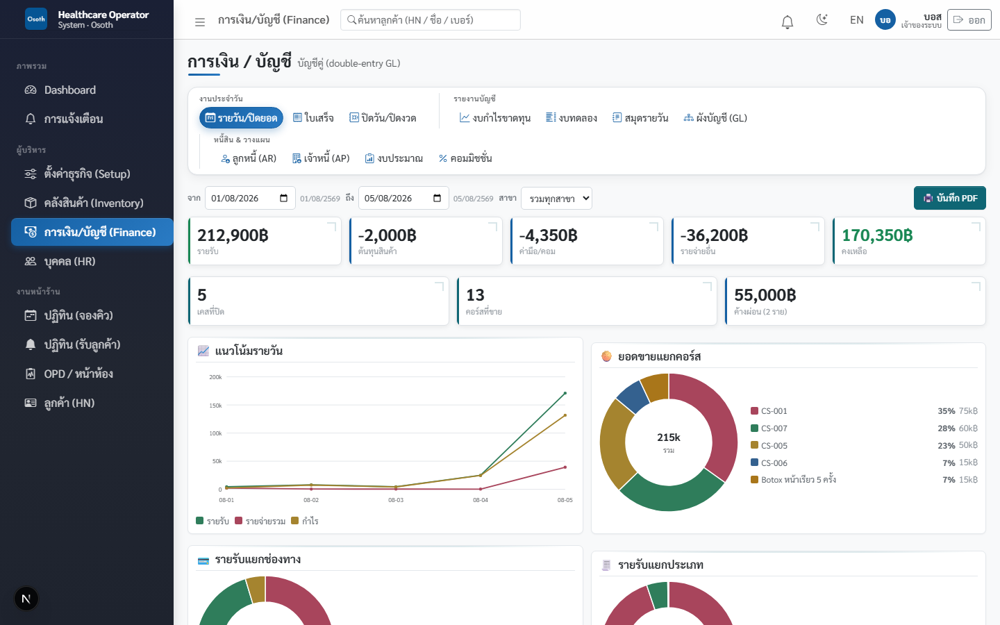

แท็บแรก **รายวัน/ปิดยอด** คือหน้าสรุปภาพรวม: เลือกช่วงวันที่และสาขาได้ เห็นกล่องตัวเลข **รายรับ / ต้นทุนสินค้า / ค่ามือ/คอม / รายจ่ายอื่น / คงเหลือ** พร้อมกราฟแนวโน้มรายวันและยอดขายแยกคอร์ส กดปุ่ม **🖨️ บันทึก PDF** เพื่อเก็บรายงานเป็นไฟล์ได้ และในหน้าเดียวกันนี้ยังคีย์ค่าใช้จ่ายประจำวัน (ค่าเช่า/ค่าน้ำไฟ ฯลฯ) ได้ด้วย

---

## 4.1 เงินเข้าจากไหนบ้าง

เงินเข้าระบบมี 3 ทางหลัก ทุกทาง **ระบบออกใบเสร็จให้อัตโนมัติทันทีที่รับเงิน** ไม่ต้องออกเอง:

### 1. ขายคอร์ส — จ่ายเต็มจำนวนเสมอ ไม่มีผ่อน

- ลูกค้าซื้อคอร์สต้อง **จ่ายเต็มราคาในครั้งเดียว** หรือยังไม่จ่ายเลย (ไปจ่ายเต็มยอดทีหลังก่อนเริ่มทำหัตถการที่ OPD) — จ่ายบางส่วนไม่ได้ ถ้าลูกค้าอยากผ่อนให้ใช้บริการผ่อนของบัตรเครดิต/เครื่อง EDC เอง ระบบจะขึ้นข้อความเตือนว่า "ต้องชำระเต็มจำนวน … ระบบไม่รองรับผ่อน"
- จ่ายเต็มจำนวนแต่ **แยกได้หลายช่องทาง** เช่น คอร์ส 15,000 บาท จ่ายเงินสด 7,500 + โอน 7,500 ได้ ขอแค่รวมกันเท่าราคาเต็มพอดี (ช่องทางที่รองรับ: **เงินสด / โอน / บัตร**)

### 2. Add-on (ทำเพิ่มหน้างาน)

- ถ้าเพิ่มใน **ครั้งแรกของคอร์ส** ราคา add-on จะถูกบวกรวมเข้ายอดคอร์ส จ่ายทีเดียวในบิลเดียวกัน
- ครั้งถัดๆ ไป ระบบเก็บเงินแยกบิลทันทีพร้อมออกใบเสร็จใบใหม่

### 3. ค่าจองคิว (ตั้งยอดได้ — รายได้ทันที)

- เจ้าของตั้งยอดที่ **ตั้งค่าธุรกิจ (Setup) → ตั้งค่า** ช่อง **ค่าจองคิว (บาท)** (0 = ไม่เก็บ) — ตั้งไว้แล้วการจองคิวล่วงหน้าทุกครั้งต้องเก็บเงินก้อนนี้ก่อนถึงจองสำเร็จ (walk-in ไม่เก็บ)
- ระบบออกใบเสร็จและลงบัญชีเป็น **รายได้ค่าจองคิว (บัญชี 4200)** ทันที — เห็นในงบกำไรขาดทุนแยกบรรทัดจากรายได้คอร์ส
- ไม่หักเข้าค่าคอร์ส ไม่คืนอัตโนมัติ — ลูกค้ายกเลิกแล้วจำเป็นต้องคืนจริงๆ ให้ใช้การยกเลิกใบเสร็จ (หัวข้อ 4.2)

### 4. มัดจำกันคิว

- วางตอนจองคิว (ดูรายละเอียดหัวข้อ 4.3) — ได้ใบเสร็จเหมือนกัน แต่เป็น "เงินรับฝาก" ไม่ใช่รายได้ จนกว่าจะถูกหักเข้าคอร์สหรือริบ

### ใบเสร็จรับเงิน — เลขรันอัตโนมัติ

เปิดดูที่แท็บ **ใบเสร็จ** เลือกวันที่จากช่องด้านบน จะเห็นใบเสร็จทุกใบของวันนั้นพร้อมยอดรวม:

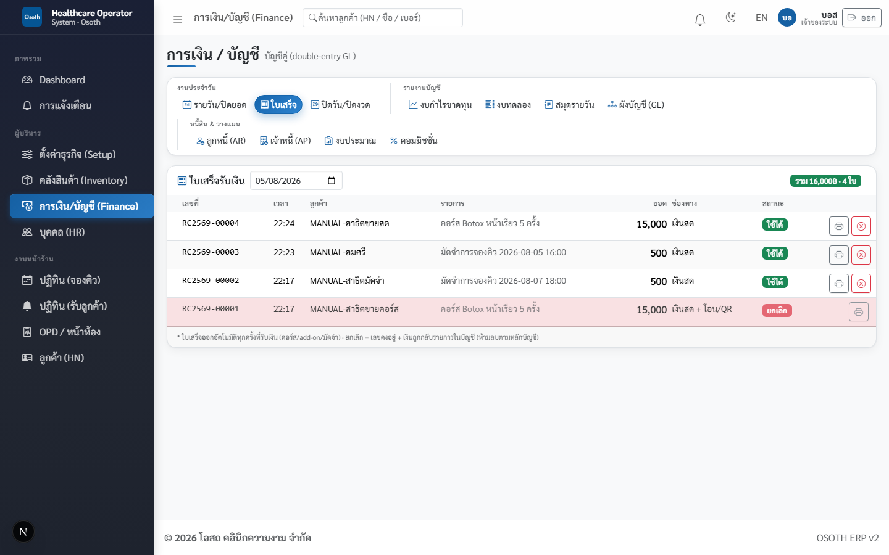

- เลขใบเสร็จรันต่อเนื่องเป็นรูปแบบ **RC + ปี พ.ศ. + ลำดับ** เช่น `RC2569-00004` (ขึ้นปีใหม่เริ่มนับ 1 ใหม่)
- คอลัมน์ **ช่องทาง** แสดงว่ารับเงินทางไหน — บิลที่จ่ายแยกหลายช่องทางจะเห็นเป็น "เงินสด + โอน/QR"
- สถานะ **ใช้ได้** = ใบเสร็จปกติ · **ยกเลิก** = ถูก void แล้ว (แถวสีแดง)

### พิมพ์ใบเสร็จให้ลูกค้า

1. ที่แท็บ **ใบเสร็จ** กดปุ่มรูปเครื่องพิมพ์ท้ายแถวของใบที่ต้องการ
2. ระบบเปิดหน้าใบเสร็จขนาด A5 พร้อมหัวบริษัท เลขประจำตัวผู้เสียภาษี รายการ ยอดรวม และช่องลงชื่อผู้รับเงิน
3. กดปุ่ม **พิมพ์ / บันทึก PDF** — จะสั่งพิมพ์กระดาษ หรือเลือกบันทึกเป็นไฟล์ PDF ส่งให้ลูกค้าทางแชทก็ได้

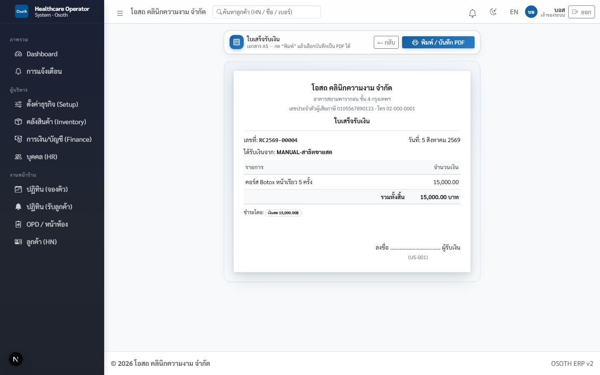

---

## 4.2 ทำบิลผิด — ยกเลิกใบเสร็จ (Void)

ออกบิลผิด เก็บเงินผิดคน หรือลูกค้าเปลี่ยนใจทันทีหลังจ่าย ให้ **ยกเลิกใบเสร็จ** (เจ้าของระบบเท่านั้น):

1. ไปที่ **การเงิน/บัญชี (Finance)** → แท็บ **ใบเสร็จ** → เลือกวันที่ของบิลนั้น
2. กดปุ่มไอคอนวงกลมกากบาทสีแดงท้ายแถว (ชื่อปุ่ม: **ยกเลิกใบเสร็จ (กลับรายการเงิน)**)
3. ระบบถามยืนยันพร้อมให้ **กรอกเหตุผล** — บังคับกรอก ไม่กรอกยกเลิกไม่ได้
4. กดตกลง — เสร็จแล้ว

สิ่งที่เกิดขึ้นอัตโนมัติหลังยกเลิก:

- **เงินทุกบรรทัดในใบถูกกลับรายการในบัญชี** — สมุดรายวันจะมีรายการ "กลับรายการ (void)" คู่กับรายการรับเงินเดิม ยอดรายรับของวันจึงถูกต้องเสมอ
- **คอร์สของลูกค้ากลับเป็นค้างชำระ** เต็มจำนวน — ไปโผล่ในแท็บ **ลูกหนี้ (AR)** จนกว่าจะเก็บเงินใหม่
- ถ้าบิลนั้นเป็นมัดจำ มัดจำจะถูกล้างเหมือนไม่เคยวาง · ส่วนบิลค่าคอร์สที่มีบรรทัด "มัดจำที่วางไว้" — มัดจำจะกลับไปค้างที่คิวตามเดิม ใช้จ่ายรอบใหม่ได้
- **เลขใบเสร็จยังคงอยู่** ไม่หายไปจากระบบ (หลักบัญชีห้ามลบเอกสาร) — ใบพิมพ์จะมีตราประทับ **ยกเลิก (VOID)** พร้อมวันเวลาและเหตุผล

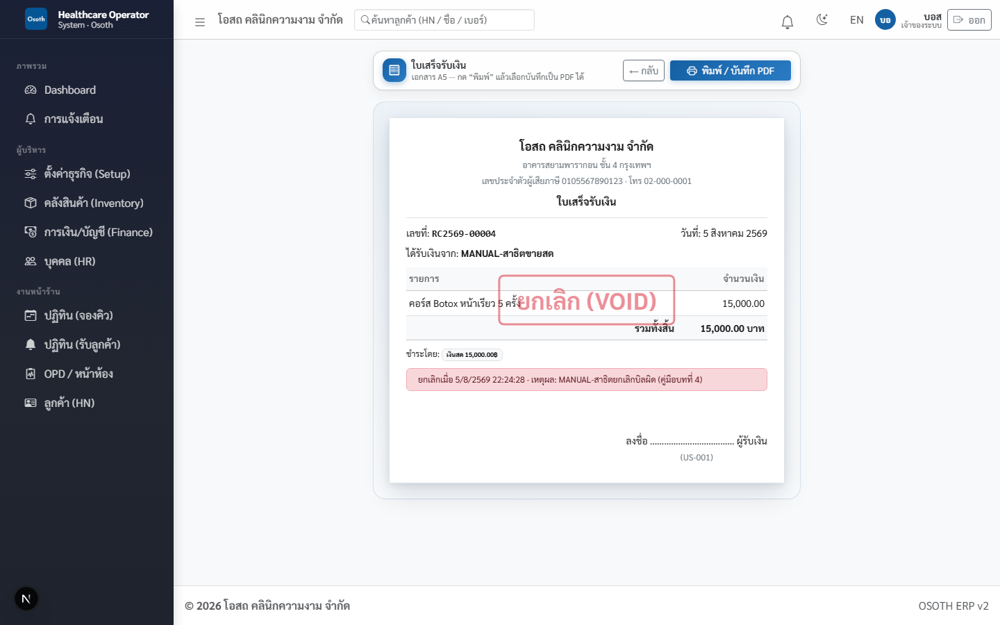

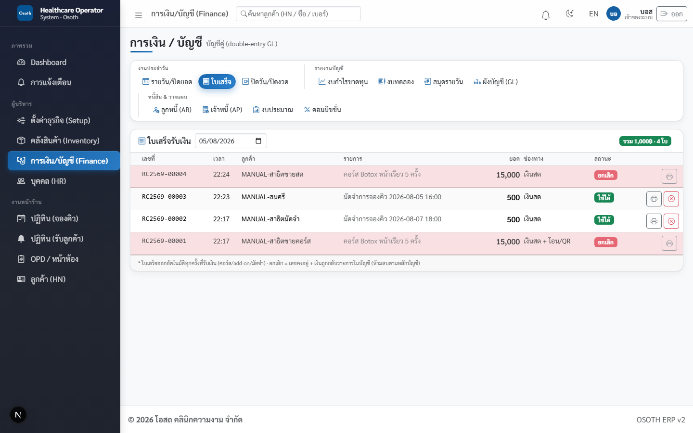

> ⚠️ ยกเลิกแล้ว**ย้อนกลับไม่ได้** — ถ้าลูกค้าจ่ายจริงให้ทำรายการขาย/รับเงินใหม่ (ได้ใบเสร็จเลขใหม่)

> 💡 กดช่องทางผิดก็ใช้วิธีเดียวกัน — เช่น ลูกค้าโอนแต่เผลอกดเงินสด ให้ยกเลิกบิลแล้วรับเงินใหม่ให้ถูกช่องทาง ไม่งั้นตอนปิดยอดสิ้นวันเงินสดในลิ้นชักจะไม่ตรงกับระบบ

> 💡 ถ้ากดยกเลิกแล้วระบบขึ้นข้อความผิดพลาด (พบได้ในบิลที่จ่ายแยกหลายช่องทาง) อย่ากดซ้ำหลายรอบ — จดเลขใบเสร็จไว้แล้วแจ้งผู้ดูแลระบบให้ตรวจสอบ

---

## 4.3 มัดจำกันคิว

มัดจำคือเงินที่ลูกค้าวางไว้ตอนจองคิวเพื่อกันเบี้ยวนัด **มัดจำยังไม่ใช่รายได้ของร้าน** — ระบบบันทึกเป็น "เงินมัดจำรับล่วงหน้า" (หนี้สิน) จนกว่าจะถูกใช้จริง

### วางมัดจำ (ตอนจอง)

1. ที่เมนู **ปฏิทิน (จองคิว)** กดเปิดการ์ดคิวที่ต้องการ
2. ในส่วน **มัดจำกันคิว** กรอกจำนวนเงิน เลือกช่องทาง (**เงินสด / โอน / บัตร**) แล้วกดปุ่ม **รับมัดจำ**
3. ระบบออกใบเสร็จมัดจำให้ทันที (รายการในใบเสร็จจะเขียนว่า "มัดจำการจองคิว" พร้อมวันเวลานัด) และการ์ดคิวขึ้นป้าย **วางแล้ว** พร้อมยอด

### มัดจำจบได้ 3 ทาง

| เหตุการณ์ | ผลกับมัดจำ | ป้ายบนการ์ดคิว |
|---|---|---|
| ลูกค้ามาตามนัดและชำระค่าคอร์ส | ที่ช่องทางจ่ายของ OPD เลือก **มัดจำที่วางไว้ (แสดงยอด฿)** ได้ 1 บรรทัด ยอดต้องเท่าที่วางพอดี — มัดจำถูกหักเข้าค่าคอร์ส | **หักเข้าค่าคอร์สแล้ว** |
| ลูกค้าไม่มา (กดปุ่ม **ไม่มาตามนัด** บนการ์ดคิว) | ระบบ **ริบมัดจำอัตโนมัติ** เข้าเป็นรายได้อื่นของร้าน | **ริบแล้ว (ยอด฿ · ไม่มาตามนัด)** |
| ลูกค้ายกเลิกล่วงหน้า | กดปุ่ม **คืนมัดจำ** บนการ์ดคิว — ระบบกลับรายการและบันทึกคืนเป็นเงินสด | ไม่มีมัดจำ |

> 💡 ลูกค้าโทรมาขอเลื่อนนัด ไม่ต้องคืนมัดจำแล้ววางใหม่ — กด **เลื่อนนัด** บนการ์ดคิวเดิมได้เลย มัดจำติดไปกับคิว

> 💡 มัดจำที่วางไว้แล้วถ้าออกบิลผิด ยกเลิกใบเสร็จมัดจำได้เหมือนบิลทั่วไป — มัดจำจะถูกล้างเหมือนไม่เคยวาง

---

## 4.4 งานประจำวันของเจ้าของ — ปิดยอด เคลียร์บัตร ล็อกงวด

เปิดแท็บ **ปิดวัน/ปิดงวด** จะเห็นการ์ด 3 ใบเรียงตามลำดับงานจริง (บนจอมีแถบบอกลำดับ: 1 นับเงินสดทุกสิ้นวัน → 2 เคลียร์เงินบัตรเมื่อธนาคารโอนเข้า → 3 ล็อกงวดเมื่อปิดบัญชีสิ้นเดือน):

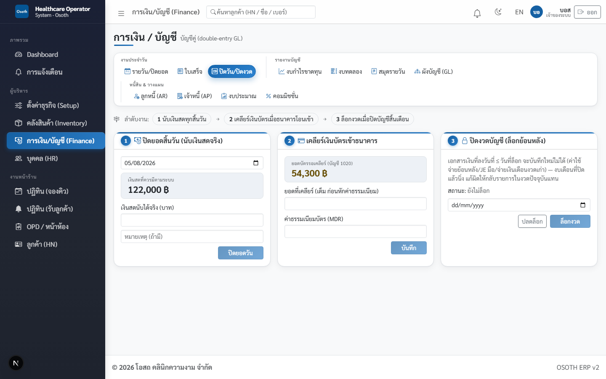

### ขั้น 1 — ปิดยอดสิ้นวัน (นับเงินสดจริง)

1. เลือกวันที่ — ระบบโชว์ **เงินสดที่ควรมีตามระบบ** (= เงินสดรับของวัน − ค่าใช้จ่ายเงินสดของวัน)
2. นับเงินในลิ้นชักจริง กรอกช่อง **เงินสดนับได้จริง (บาท)** (ใส่หมายเหตุได้)
3. กดปุ่ม **ปิดยอดวัน**

ถ้านับได้ไม่ตรงกับระบบ **ส่วนต่างถูกลงบัญชีให้อัตโนมัติ** — เงินขาดลงเป็นค่าใช้จ่าย เงินเกินลงเป็นรายได้อื่น พร้อมแสดงผลว่า "ขาด/เกิน เท่าไร (ลงบัญชีแล้ว)"

> ⚠️ ปิดยอดได้ **วันละครั้งเดียว** ต่อสาขา — กดซ้ำระบบจะแจ้งว่า "วันนี้ปิดยอดไปแล้ว" ดังนั้นนับเงินให้เรียบร้อยก่อนกด

### ขั้น 2 — เคลียร์เงินบัตรเข้าธนาคาร

เงินที่ลูกค้ารูดบัตรยังไม่ใช่เงินในธนาคารทันที ระบบพักไว้ในบัญชี "ลูกหนี้บัตรเครดิต (รอเคลียร์)" — การ์ดใบนี้โชว์ **ยอดบัตรรอเคลียร์** ให้เห็นตลอด

เมื่อธนาคารโอนยอดบัตรเข้าบัญชีร้าน (ปกติวันถัดไป):

1. กรอก **ยอดที่เคลียร์ (เต็ม ก่อนหักค่าธรรมเนียม)**
2. กรอก **ค่าธรรมเนียมบัตร (MDR)** ที่ธนาคารหัก
3. กดปุ่ม **บันทึก** — ระบบลงบัญชีให้: เงินเข้าธนาคารสุทธิ + ค่าธรรมเนียมเป็นค่าใช้จ่าย และตัดยอดรอเคลียร์ออก

ประวัติการเคลียร์แต่ละครั้งแสดงใต้ฟอร์ม เช่น "เคลียร์ 10,000฿ − ค่าธรรมเนียม 150฿ = เข้าธนาคาร 9,850฿"

### ขั้น 3 — ปิดงวดบัญชี (ล็อกย้อนหลัง) ทุกสิ้นเดือน

เมื่อตรวจตัวเลขของเดือนเสร็จแล้ว เลือกวันที่แล้วกดปุ่ม **ล็อกงวด** — หลังจากนั้น **เอกสารเงินที่ลงวันที่ก่อนหรือเท่ากับวันล็อกจะบันทึกใหม่ไม่ได้** (คีย์ค่าใช้จ่ายย้อนหลัง บันทึกบัญชีมือ จ่ายเงินเดือนงวดเก่า ปิดยอดวัน เคลียร์เงินบัตรย้อนหลัง — โดนกันหมด) งบของเดือนที่ปิดแล้วจึงนิ่ง ไม่มีใครแอบแก้ย้อนหลัง

> 💡 เจอรายการผิดในเดือนที่ล็อกแล้ว อย่าปลดล็อกไปแก้ — ให้บันทึกรายการกลับ (ปรับปรุง) ในงวดปัจจุบันแทน ตามหลักบัญชี · ถ้าจำเป็นจริงๆ กด **ปลดล็อก** ได้ (เจ้าของเท่านั้น)

---

## 4.5 บัญชีอัตโนมัติเบื้องหลัง — ระบบลงบัญชีให้เองทั้งหมด

ไม่ต้องมีนักบัญชีนั่งลงรายการ — **ทุกธุรกรรมในระบบถูกลงบัญชีคู่ (เดบิต/เครดิต) ให้อัตโนมัติ** เปิดดูได้ที่แท็บ **สมุดรายวัน** ซึ่งติดป้ายที่มาของแต่ละรายการ (รับเงิน / ต้นทุนยา / ค่าตอบแทน / ค่าใช้จ่าย / รับของ ฯลฯ):

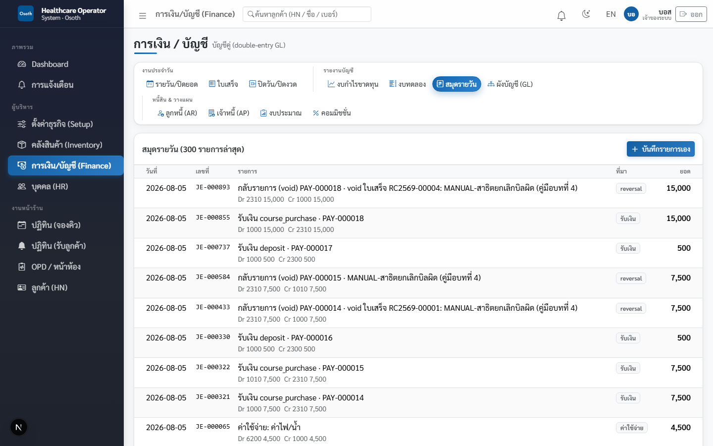

เรื่องที่ควรเข้าใจ (แบบง่ายๆ):

- **เงินค่าคอร์สยังไม่นับเป็นรายได้ทันที** — ตอนลูกค้าจ่าย ระบบพักไว้เป็น "รายได้รับล่วงหน้า (คอร์ส)" ก่อน แล้วค่อยๆ **รับรู้เป็นรายได้จริงทีละครั้งตามที่ลูกค้ามาใช้บริการ** (ตอนปิดเคส) เช่น คอร์ส 5 ครั้ง 15,000 บาท มาใช้ 1 ครั้ง = รับรู้รายได้ 3,000 บาท (ครั้งสุดท้ายรับรู้ส่วนที่เหลือทั้งหมด เศษปัดจึงไม่ตกค้าง) — งบกำไรขาดทุนจึงสะท้อนงานที่ทำจริง ไม่ใช่แค่เงินที่เก็บได้
- **ต้นทุนยา/เวชภัณฑ์ตัดตอนปิดเคส** — ระบบตัดสต๊อกแบบ FIFO (ขวดเก่าก่อน) แล้วบันทึกต้นทุนตามราคาทุนจริงของ lot ที่ใช้ เข้าเป็นต้นทุนขาย (COGS) ของวันนั้น
- **ค่ามือหมอ/BT และคอมมิชชั่นไม่จ่ายทันที** — ตอนปิดเคสระบบบันทึกเป็น "ค่าตอบแทนพนักงานค้างจ่าย" ไว้ก่อน แล้วเคลียร์จ่ายจริงรวมกับเงินเดือนสิ้นเดือน (หัวข้อ 4.7)
- **มัดจำเป็นหนี้สิน** จนกว่าจะหักเข้าค่าคอร์สหรือถูกริบ (หัวข้อ 4.3)

> 💡 อยากบันทึกรายการเองเป็นกรณีพิเศษ (เช่น ปรับปรุงบัญชี) กดปุ่ม **บันทึกรายการเอง** ในแท็บสมุดรายวัน — ต้องใส่ยอดเดบิตเท่ากับเครดิตเสมอ ไม่งั้นระบบไม่ให้บันทึก

---

## 4.6 รายงานการเงิน — อ่านยังไง ดูอะไร

### งบกำไรขาดทุน

เลือกช่วงวันที่มุมขวาบน — เห็น **รายได้** (รายได้คอร์ส/บริการ + รายได้ add-on/อื่นๆ) ลบ **ค่าใช้จ่าย** แยกกลุ่ม: COGS (ต้นทุนยา) · LABOR (ค่ามือ+คอม) · OPEX (เงินเดือน ค่าเช่า น้ำไฟ ค่าธรรมเนียมบัตร) · FREIGHT (ขนส่ง) · PEC (เตรียมเปิดสาขา) ปิดท้ายด้วยกล่อง **กำไร (ขาดทุน) สุทธิ** ตัวใหญ่

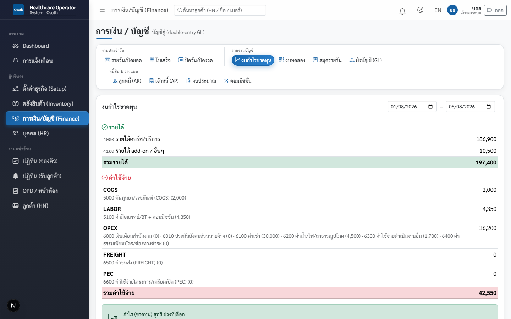

### งบทดลอง (Trial Balance)

ยอดสะสมทุกบัญชีในผัง พร้อมป้าย **✓ สมดุล** — ถ้าขึ้น "✗ ไม่สมดุล!" แปลว่ามีปัญหาข้อมูล ให้แจ้งผู้ดูแลระบบทันที (ปกติจะสมดุลเสมอเพราะระบบลงบัญชีคู่อัตโนมัติ)

### สมุดรายวัน

รายการบัญชีทีละบรรทัด 300 รายการล่าสุด — ใช้ไล่ตรวจว่าเงินก้อนไหนมาจากธุรกรรมอะไร (ดูภาพหัวข้อ 4.5)

### ลูกหนี้ (AR)

คอร์สที่ลูกค้ายังค้างชำระทั้งหมด พร้อมจำนวนวันที่ค้าง — ค้างเกิน 7 วันป้ายเหลือง เกิน 30 วันป้ายแดง ใช้เป็นลิสต์ตามเก็บเงิน (บิลที่ถูก void จะกลับมาโผล่ที่นี่จนกว่าจะเก็บเงินใหม่)

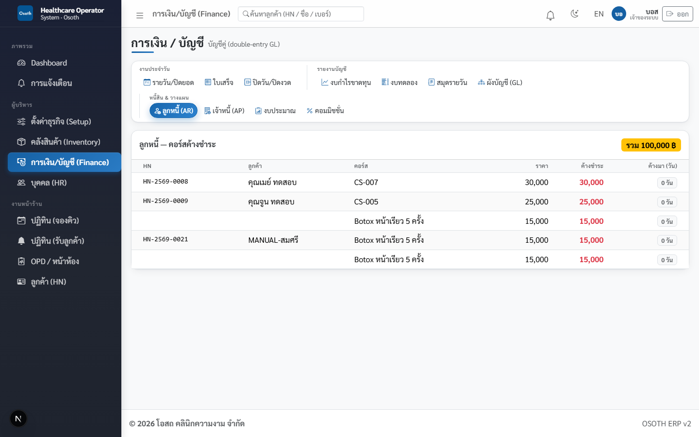

### เจ้าหนี้ (AP)

บิลที่ร้านต้องจ่ายคนอื่น — บิลจากการรับของตามใบสั่งซื้อ (PO) เกิดอัตโนมัติ หรือคีย์บิลเองที่ฟอร์ม **คีย์บิลเจ้าหนี้** ด้านขวา (เลือกผู้ขาย ยอด วันครบกำหนด) แล้วกด **ตั้งหนี้ + ลงบัญชี** · ถึงเวลาจ่ายกดปุ่ม **จ่าย** ท้ายแถว — ระบบถามยืนยันแล้วบันทึกจ่ายยอดค้างทั้งก้อนเป็นเงินโอน

### งบประมาณ

ตั้งงบรายปีต่อบัญชี (กรอกยอดทั้งปี ระบบเฉลี่ย 12 เดือน) แล้วดูแถบเปอร์เซ็นต์เทียบ **งบทั้งปี / ใช้จริง / คงเหลือ/เกิน** — แถบเขียว = ปกติ เหลือง = ใช้เกิน 80% แดง = เกินงบ

---

## 4.7 เงินเดือน (HR → เงินเดือน)

เปิดเมนู **บุคคล (HR)** → แท็บ **เงินเดือน** เลือกเดือนที่ต้องการ — ระบบคำนวณ **งวดร่าง (draft) ให้อัตโนมัติทุกคน**:

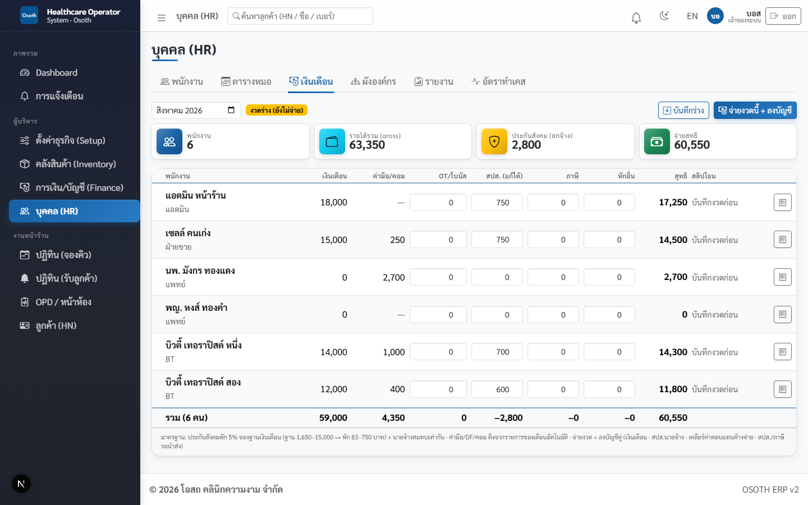

สูตรต่อคน:

```
สุทธิ = เงินเดือน + ค่ามือ/คอมของเดือน (อัตโนมัติ) + OT/โบนัส
        − ประกันสังคม − ภาษี − หักอื่น
```

- **ค่ามือ/คอม** ดึงจากรายการที่เกิดจริงในเดือนนั้นอัตโนมัติ (ค่ามือหมอ/BT ตอนปิดเคส + คอมต่างๆ) — ช่องนี้แก้ตัวเลขเองไม่ได้ เพราะมาจากงานที่เกิดจริง
- **ประกันสังคม (สปส.)** ระบบคำนวณให้ = 5% ของฐานเงินเดือน (ฐานขั้นต่ำ 1,650 เพดาน 15,000 ปัดเป็นบาทเต็ม) → หักจริงอยู่ระหว่าง **83–750 บาท** และนายจ้างสมทบเท่ากันอีกก้อน (ลงบัญชีให้เอง) — ช่อง **สปส. (แก้ได้)** แก้ตัวเลขรายคนได้ถ้าจำเป็น
- **ภาษี / หักอื่น / OT-โบนัส** กรอกเองรายคน
- **พนักงานเดือนแรก** ระบบคิดให้ตามวันเข้างานจริง: เงินเดือน = จำนวนวันที่เช็คอินจริง × (เงินเดือน ÷ 30) พร้อมป้ายเตือน "เดือนแรก · มาจริง N วัน" — คนที่ยังไม่เริ่มงานในเดือนนั้นเงินเดือนเป็น 0

ขั้นตอนจ่าย:

1. ตรวจ/แก้ตัวเลขรายคน แล้วกด **บันทึกร่าง** (บันทึกไว้ก่อนได้ ยังแก้ได้)
2. พร้อมจ่ายจริง กด **จ่ายงวดนี้ + ลงบัญชี** และยืนยัน — ระบบลงบัญชีคู่ให้ครบ (เงินเดือน สปส.นายจ้าง เคลียร์ค่ามือ/คอมค้างจ่าย สปส./ภาษีรอนำส่ง)
3. โอนเงินให้พนักงานแล้ว **แนบสลิปโอนรายคน** ที่คอลัมน์ **สลิปโอน** (ปุ่ม **แนบ** — รองรับรูป/PDF ไม่เกิน 3MB ต้องบันทึกงวดก่อนถึงจะแนบได้)
4. ปุ่มรูปใบเสร็จท้ายแถว = พิมพ์ **สลิปเงินเดือน (Pay Slip)** ให้พนักงาน

> ⚠️ **กดจ่ายแล้วแก้ไขงวดนั้นไม่ได้อีก** — ระบบขึ้นป้าย "จ่ายแล้ว" และล็อกทุกช่อง ถ้ากดพลาดระบบจะแจ้ง "งวดนี้จ่ายแล้ว แก้ไขไม่ได้" ดังนั้นตรวจยอดรวมสุทธิให้ดีก่อนยืนยัน

พนักงานแต่ละคนดูรายได้ของตัวเองได้เองที่เมนู **รายได้ของฉัน** — เห็นเงินเดือนฐาน ค่ามือ/คอมรายรายการ (อ้างอิงเลขเคส) ประกันสังคมโดยประมาณ และประมาณรับสุทธิ โดยไม่เห็นของคนอื่น:


---

## 4.8 คอมมิชชั่น

เปิดที่ **การเงิน/บัญชี (Finance)** → แท็บ **คอมมิชชั่น** เลือกเดือน:

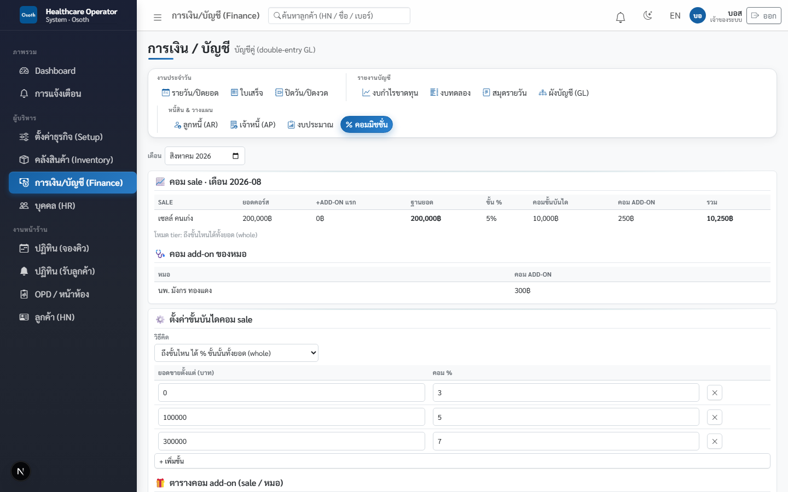

### คอมเซลส์ = ขั้นบันไดจากยอดขายรวมต่อเดือน + คอม add-on

- **ฐานยอด** ของเซลส์แต่ละคน = ยอดขายคอร์สของเดือน + ราคา add-on ครั้งแรกที่รวมบิลคอร์ส
- ระบบเทียบฐานยอดกับ **ขั้นบันได** ที่ตั้งไว้ (ตาราง "ยอดขายตั้งแต่ (บาท) / คอม %") — ตัวอย่างบนภาพ: ยอด 0 ขึ้นไปได้ 3% · ถึง 100,000 ได้ 5% · ถึง 300,000 ได้ 7%
- **วิธีคิด** เลือกได้ 2 แบบที่ช่อง "วิธีคิด": **ถึงขั้นไหน ได้ % ขั้นนั้นทั้งยอด (whole)** — แบบมาตรฐาน เช่น ยอด 200,000 อยู่ขั้น 5% ก็ได้ 5% ของทั้ง 200,000 = 10,000 บาท · หรือ **คิดเป็นชั้นๆ (marginal)** คิด % เฉพาะส่วนที่เกินแต่ละขั้น
- **คอม add-on** เพิ่มต่างหากตามตาราง **ตารางคอม add-on (sale / หมอ)** — คนที่แนะนำ add-on (เซลส์หรือหมอ) ได้คอมเป็น % หรือบาท/ชิ้นตามที่ตั้ง (add-on ครั้งแรกของคอร์สไม่คิดคอมซ้ำ เพราะรวมอยู่ในฐานขั้นบันไดแล้ว) · คอม add-on ของหมอแสดงแยกในตาราง **คอม add-on ของหมอ**

ตารางสรุปโชว์ครบ: ยอดคอร์ส / +ADD-ON แรก / ฐานยอด / ขั้น % / คอมขั้นบันได / คอม ADD-ON / **รวม**

> 💡 คอมมิชชั่นไม่ได้จ่ายแยก — ยอดคอมทั้งหมดไหลเข้าช่อง **ค่ามือ/คอม** ของงวดเงินเดือนเดือนนั้นอัตโนมัติ (หัวข้อ 4.7) และพนักงานเห็นของตัวเองที่ **รายได้ของฉัน**

---

## สรุปงานการเงินที่ต้องทำเป็นประจำ

| ความถี่ | งาน | ที่ไหน |
|---|---|---|
| ทุกครั้งที่รับเงิน | พิมพ์/ส่งใบเสร็จให้ลูกค้า (ระบบออกให้เอง) | แท็บ **ใบเสร็จ** |
| ทุกสิ้นวัน | นับเงินสดจริง + **ปิดยอดวัน** | แท็บ **ปิดวัน/ปิดงวด** ขั้น 1 |
| เมื่อธนาคารโอนยอดบัตรเข้า | บันทึก **เคลียร์เงินบัตร** พร้อมค่าธรรมเนียม | แท็บ **ปิดวัน/ปิดงวด** ขั้น 2 |
| ทุกสัปดาห์ | ไล่ตาม **ลูกหนี้ (AR)** · ดูบิล **เจ้าหนี้ (AP)** ใกล้ครบกำหนด | แท็บ AR / AP |
| ทุกสิ้นเดือน | จ่ายเงินเดือน + แนบสลิป → ตรวจงบ → **ล็อกงวด** | HR **เงินเดือน** → แท็บ **ปิดวัน/ปิดงวด** ขั้น 3 |
